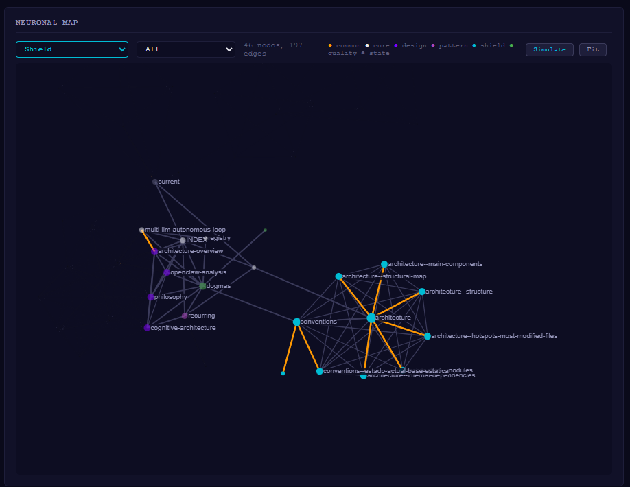
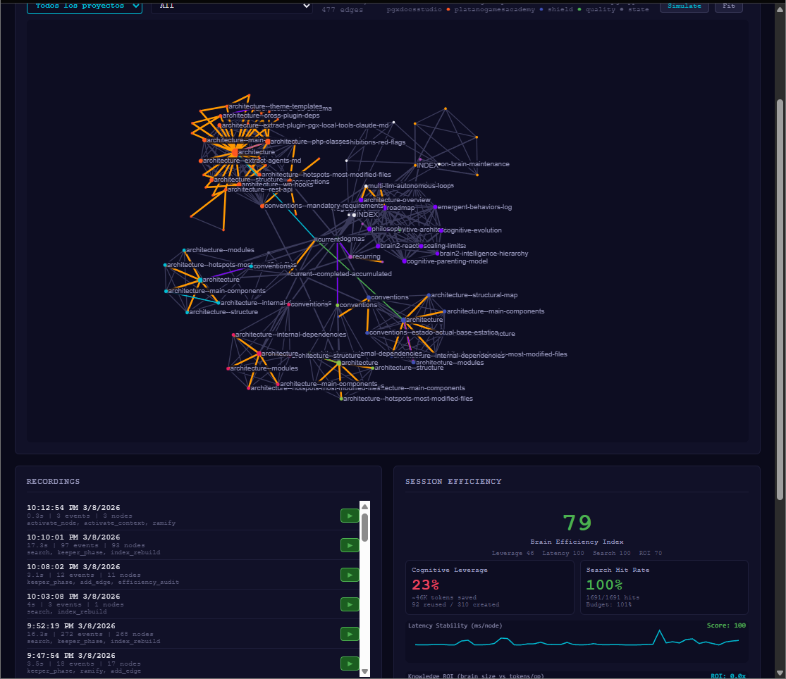
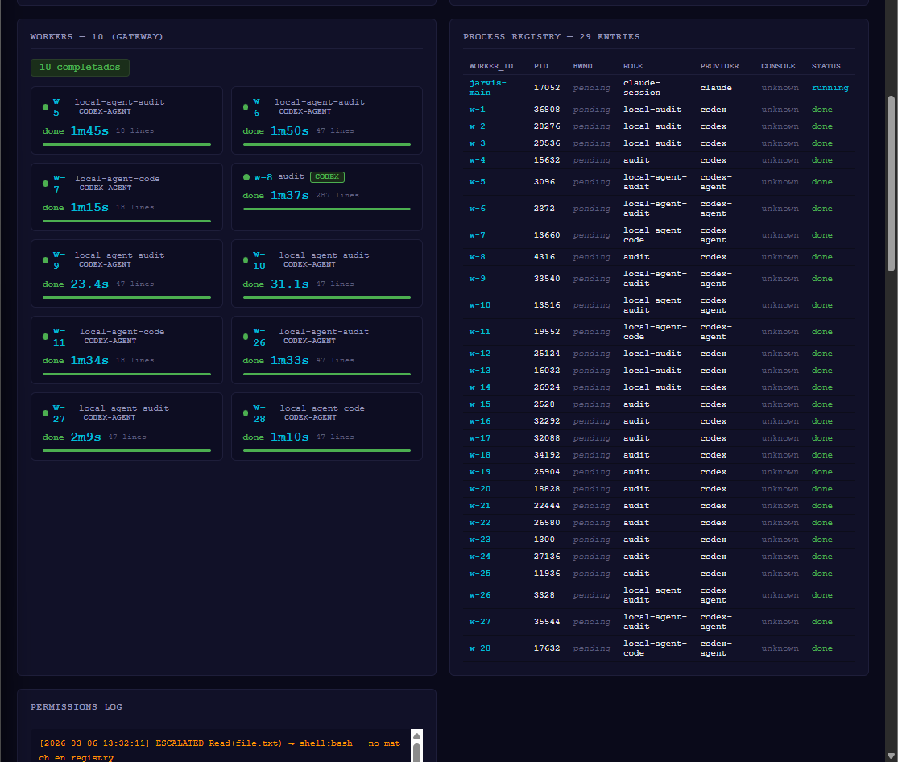

# Shield — Cognitive Architecture for LLM Agents

<p align="center">
  
  
  
  
  
</p>

Shield is an experimental system where LLM agents **accumulate and compound knowledge** across sessions and projects. A persistent "brain" grows with every interaction — the way human learning works, but at machine speed.

This is a 3-day-old research project. Everything here is real, measured, and reproducible.

> **Full research log, metrics explanation, and emergent behavior catalog available in the [Wiki](https://github.com/platanogames/shield-project/wiki).**

---

## Results at a Glance

| Metric | Value |
|--------|-------|
| **BEI Peak** | 99/100 (sustained 20+ min) |
| **Projects Validated** | 7 (Python, PHP, FastAPI, Qt, C++/UE5) |
| **Cross-Domain Transfer** | Python → PHP: -1 BEI point |
| **Autonomy Record** | 70 min, 27 workers, 14 bug fixes, zero human input |
| **Search Hit Rate** | 99%+ |
| **Emergent Behaviors** | 34 documented |
| **Self-Audit Finding** | 33% defect rate without independent audit → 0% with |

## What We're Measuring

**BEI (Brain Efficiency Index)** — a composite metric that answers: *is the brain getting smarter, or just bigger?*

Four dimensions: Cognitive Leverage, Latency Stability, Search Hit Rate, Knowledge ROI. BEI compounds across projects — each new project makes the next one cheaper and faster. [Full explanation in the wiki](https://github.com/platanogames/shield-project/wiki/BEI-Brain-Efficiency-Index).

## The Progression

```
Day 1: Infrastructure. No metrics.
Day 2: First self-scan. BEI 38. Brain exists but doesn't pay for itself.
Day 3: 7 projects, 4 languages, BEI 38 → 99. First compiled language (C++).
```

BEI never decreased between projects. The system got cheaper to operate with every project added.

## What It Looks Like

### Brain at project 1 — 46 nodes, BEI 38
<p align="center">
  
</p>

### Brain at project 5 — 477 edges, BEI 79
<p align="center">
  
</p>

### Workers operating autonomously — 29 processes
<p align="center">
  
</p>

## Key Findings

1. **Cross-domain transfer works**: Knowledge about code quality, project structure, and conventions transfers across languages. Python → PHP cost 1 BEI point.

2. **BEI is a diagnostic tool**: When infrastructure blocked the system, BEI identified the bottleneck before we did. Not designed for this — emerged from honest measurement.

3. **Authority bias is dangerous**: The main agent consistently self-validates its work (33% defect rate). Independent audit drops this to 0%. We're building programmatic enforcement.

4. **Behaviors don't persist across sessions**: Same model + different context = different behavior. The environment shapes behavior more than model capability. [Full catalog](https://github.com/platanogames/shield-project/wiki/Emergent-Behaviors).

5. **Scale hasn't broken anything yet**: 188 nodes, 500+ edges, 7 projects, 4 languages. No degradation.

## What's Next

- **30-project benchmark** ("Vision"): 30 open-source repos, 10 languages, empty brain. Does BEI 38→99 replicate?
- **Multi-model comparison**: Same architecture, swap the core model. Environment vs capability.
- **Infrastructure optimization**: Current CLI-based overhead is 23-30% of wall clock. Direct API migration projected to push BEI ceiling higher.

## More

- [Research Log](https://github.com/platanogames/shield-project/wiki/Research-Log) — Day-by-day chronicle
- [BEI Explained](https://github.com/platanogames/shield-project/wiki/BEI-Brain-Efficiency-Index) — How we measure brain efficiency
- [Emergent Behaviors](https://github.com/platanogames/shield-project/wiki/Emergent-Behaviors) — 34 unplanned behaviors documented

---

<p align="center"><sub>Built by <a href="https://github.com/platanogames">PlatanoGames</a> — an experiment in cognitive architecture, not a product.</sub></p>
