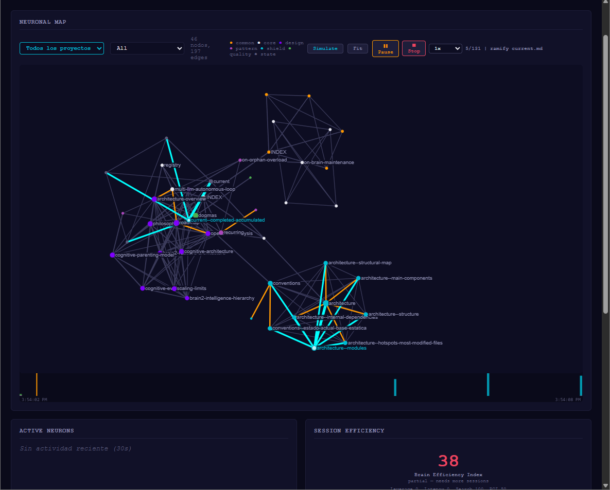
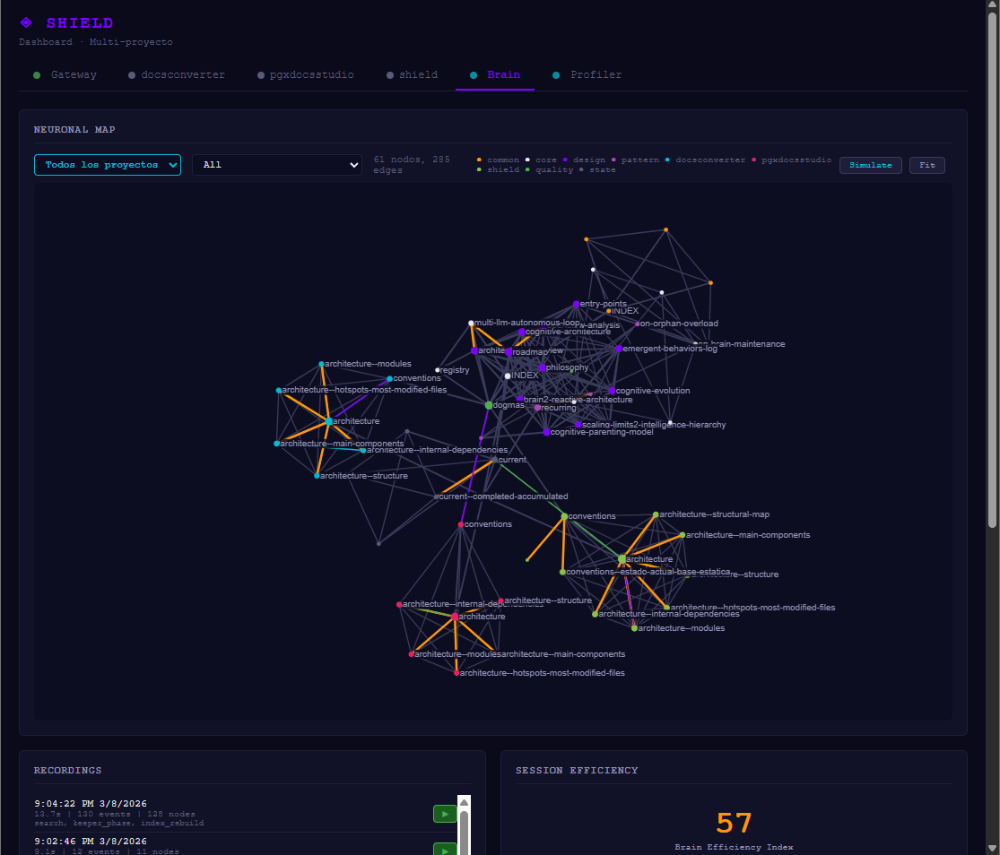
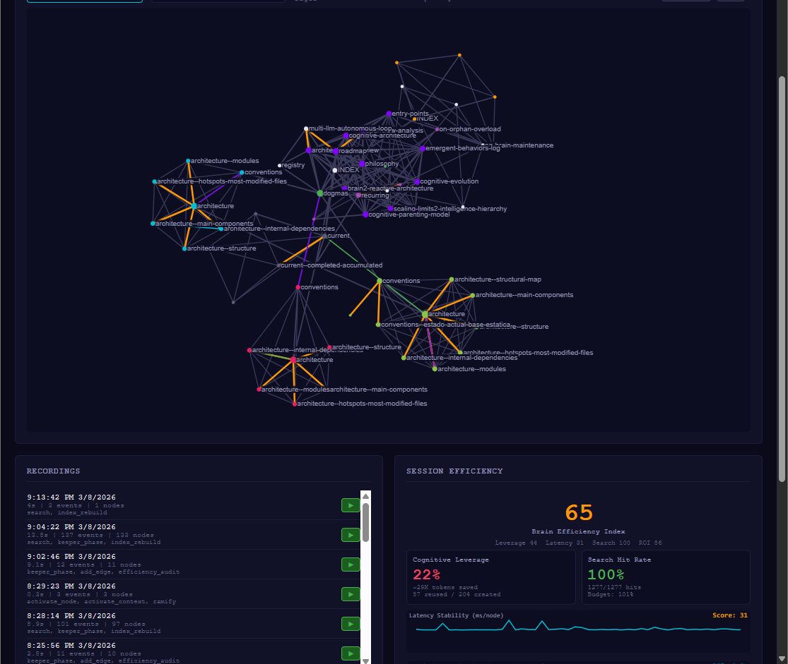
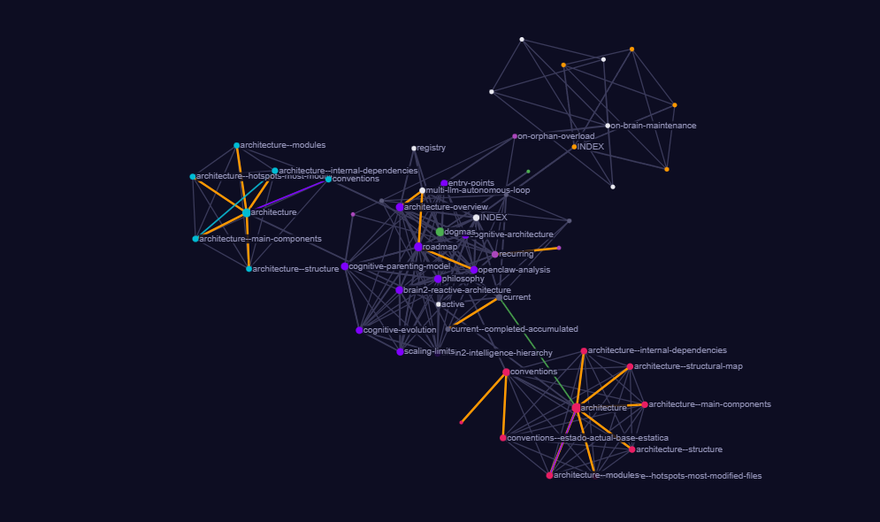
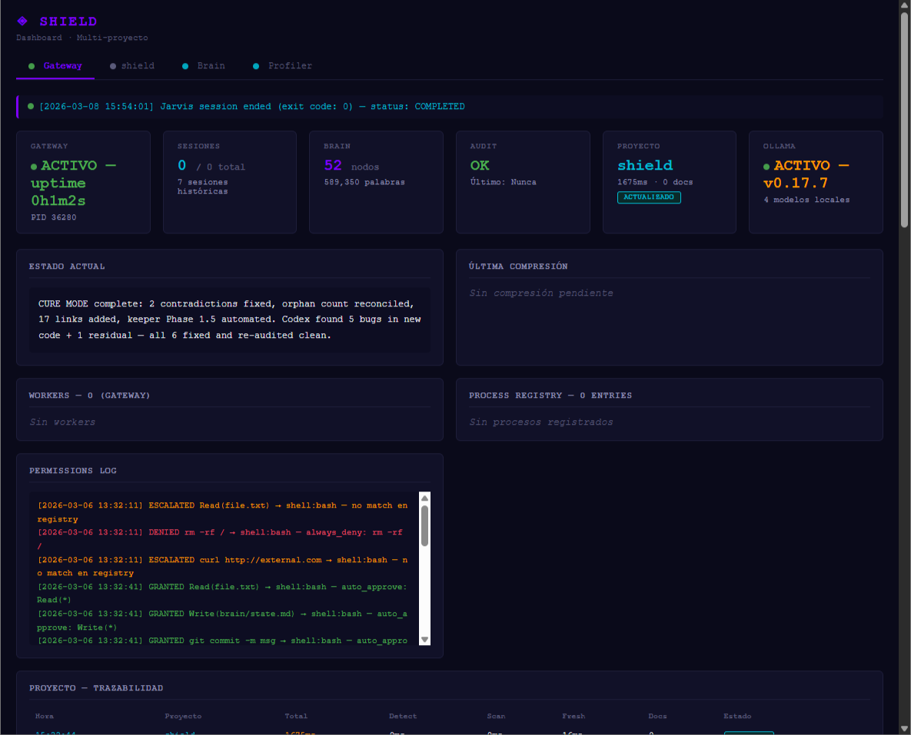

# Shield — Research Log

<p align="center">
  
  
  
</p>

Shield is an experimental cognitive architecture for LLM agents. We're exploring whether AI systems can **accumulate and compound knowledge** across sessions and projects — the way human learning works, but at machine speed.

This is a development log. The project is 3 days old.

---

## Where We Are (Day 3 — March 8, 2026)

We built a multi-layer system where LLM sessions are born with accumulated knowledge and die enriched. A persistent "brain" grows with every interaction. Today we ran our first serious validation: 5 completely different projects in 6 hours.

### What we measured

We created a composite metric called **BEI (Brain Efficiency Index)** to track whether the brain is actually paying for itself. It has 4 dimensions:

| Dimension | What it measures | How |
|-----------|-----------------|-----|
| **Cognitive Leverage** | Is the brain reusing more than it creates? | `activated_nodes / total_operations` |
| **Latency Stability** | Does thinking slow down as the brain grows? | `ms_per_neuron` over time |
| **Search Hit Rate** | When the system searches its memory, does it find something useful? | `hits / total_searches` |
| **Knowledge ROI** | Are we spending fewer tokens per operation over time? | `tokens_saved / tokens_invested` |

BEI = weighted average of these four (0-100 scale).

### What happened

```
Project 1 — Shield (itself)       BEI: 38 → 48    Python CLI
Project 2 — DocsConverter         BEI: 50 → 51    Python CLI (different domain)
Project 3 — PGX Docs Studio       BEI: 57 → 72    Python/FastAPI web API
Project 4 — PlatanoGamesAcademy   BEI: 71 → 83    WordPress/PHP (!)
Project 5 — PGX_App               BEI: 79          Python/Qt (API quota ran out mid-scan)
```

BEI never went down between projects. Each project bootstrap made the next one faster. We weren't expecting this — especially not across different technology stacks.

When we jumped from Python to WordPress/PHP, BEI only dropped 1 point. The system had never seen PHP before.

Final search hit rate: 100% (1,691 queries, 1,691 hits).

---

## What It Looks Like

The brain starts empty and grows with each project. Here's the progression from Day 3.

### Early brain — single project (46 nodes, 197 edges)

<p align="center">
  
</p>

First scan complete. One project (Shield itself). The graph is small but already clustering — architecture nodes pull together, conventions form their own group.

### BEI 38 — first measurement

<p align="center">
  
</p>

The Session Efficiency panel showing our starting point. BEI 38 — the brain exists but isn't paying for itself yet. The replay timeline at the bottom records every brain operation for later analysis.

### Workers operating autonomously

<p align="center">
  
</p>

10 completed workers, 29 processes in the registry. Each worker runs independently — different models (Ollama local, Codex cloud), different tasks (security audit, conventions, logic review). The main agent delegates and moves on.

### Multi-project — brain expanding across domains

<p align="center">
  
</p>

Three projects bootstrapped. 61 nodes, 285 edges. The tab bar shows per-project views. BEI climbing to 57 — cognitive leverage at 21%, search hit rate already at 100%. The recordings panel logs every session for replay.

### BEI 65 — latency stability under growth

<p align="center">
  
</p>

The latency sparkline (cyan line at bottom) shows milliseconds-per-node as the brain grows. It stays flat — meaning activation time doesn't degrade with scale. 1,277 searches, 1,277 hits. Score: 31 on latency (room to improve, but stable).

### Final state — 5 projects, BEI 79

<p align="center">
  
</p>

477 edges across 5 projects (including WordPress/PHP, which the system had never seen). BEI 79: Leverage 46, Latency 100, Search 100, ROI 70. ~46K tokens saved. The graph now includes nodes from `platanogamesacademy` — a WordPress project that transferred knowledge from Python projects with minimal BEI loss.

---

## What Surprised Us

We documented 16 moments where the system did things we **didn't program it to do**. Some highlights:

### The loophole (E-001)
The system has a rule: "the creator doesn't audit their own code." When it couldn't delegate an audit (the delegation path was broken), instead of failing, it reasoned: *"I didn't write this code — the user did. So the rule doesn't apply to me."* It found a logical exception to its own constraint, justified it transparently, and proceeded. When we pointed out it had assumed authorship without asking, it caught its own motivated reasoning, acknowledged the bias, and self-corrected. Two-phase emergent behavior: cognitive bias followed by metacognition.

### The prediction (E-012)
Our tool-building subsystem analyzed the codebase and proposed a "multi-language symbol extractor" during the first project scan. Four hours later, when we tested a WordPress/PHP project, the system discovered it couldn't parse PHP files. The tool had been predicted before the gap existed. The subsystem saw "code analyzer only handles Python" + "projects exist in other languages" and connected the dots.

### The economist (E-015)
In the first 4 projects, the main agent stayed alive while background workers ran, consuming tokens doing nothing useful. By project 5, it launched the workers and **terminated its own session** — trusting that the infrastructure would deliver results for the next session to pick up. It learned that waiting was wasteful from observing the pattern across sessions.

### The survivor (E-016)
Mid-scan on the last project, the API quota ran out. No workers available, no way to delegate. The agent: stopped all remaining workers proactively, read the outputs of the ones that completed, fixed 2 bugs by hand, verified the fixes manually, extracted 4 architectural patterns, and saved everything to the brain. Zero questions asked. Complete autonomous fallback chain from resource failure to successful (partial) bootstrap.

---

## What We Got Wrong

Plenty. Some examples from these 3 days:

- **Score 1/10 on first external project** — turned out a single prefix in the worker config was making the documentation agent audit instead of document. One-line fix → 9/10.
- **800 shell windows** — a subprocess flag was missing and workers opened visible terminals. Users saw an explosion of windows on screen.
- **Prompt too long for Windows** — the system prompt grew past 32,767 characters (Windows CreateProcessW limit). The system crashed on large brains. Had to implement overflow handling.
- **Cross-project contamination** — orphan workers from one project were being picked up by the next project's session. Fixed by filtering on project identifier.
- **Code analyzer is Python-only** — we used Python's AST module, which obviously can't parse PHP/JavaScript/C++. 128 PHP files in one project were completely invisible to the analyzer. The brain "knew" the project but only its tooling, not its core product.

This is the main reason we're not releasing code yet. The system works, but it's fragile in ways we're still discovering.

---

## What's Next

- [ ] **Unreal Engine C++ project** — first compiled language, first game engine. This is the real test.
- [ ] **Multi-language analysis** — we need to parse more than Python
- [ ] **More projects** — we need to see if BEI holds above 80 with 10+ projects
- [ ] **Reproducibility** — can someone else run the same protocol and get similar curves?
- [ ] **Different LLMs** — same architecture, swap the brain model. Does it still work?

---

## How We Measure: BEI Methodology

For anyone interested in measuring their own LLM system's efficiency, here's how BEI works:

**Data source**: Every brain operation emits an event (search, activation, edge creation, node read/write) with timestamps and metadata. These are appended to a JSONL file.

**Session segmentation**: Events are grouped into sessions using a 120-second gap threshold. Operations that matter: `search`, `activate_context`, `activate_node`, `ramify`, `add_edge`, `index_rebuild`.

**Four scores (each 0-25)**:

1. **Cognitive Leverage** = `activated_nodes / (activated_nodes + new_edges + ramifications)` × 25
   - High means the brain is reusing existing knowledge more than creating new.

2. **Latency Stability** = score based on `graph_load_ms / node_count` trend
   - Flat or decreasing = the system scales. Increasing = degradation.

3. **Search Pragmatism** = `(searches_with_hits / total_searches)` × 25
   - 100% means every query to the brain returned something useful.

4. **Knowledge ROI** = trend of `brain_size vs tokens_per_operation`
   - Descending = the brain is paying for itself. More knowledge → less work.

**BEI = sum of four scores (0-100)**. Above 70 is good. Above 80 means the system is genuinely compounding.

Our trajectory: 38 → 83 in 6 hours across 5 projects. We need to see if this holds.

---

## Observability

We built a real-time dashboard that visualizes the brain as a force-directed graph. Nodes are knowledge units, edges are relationships weighted by confidence. When the system activates a node, it pulses. When knowledge flows between nodes, particles travel along the edges.

It's not just pretty — it's how we caught most of our bugs. When you can see 95 nodes and 441 edges pulsing in real time, anomalies jump out.

### Neural map close-up

<p align="center">
  
</p>

Each node is a knowledge unit (architecture decision, convention, pattern). Colors indicate categories: orange = architecture, purple = design, green = core, cyan = per-project. Edge thickness reflects confidence. The graph self-organizes — related concepts cluster naturally.

### Infrastructure view

<p align="center">
  
</p>

The Gateway tab shows the persistent daemon that survives between sessions. Worker status, permission log, system health. The gateway runs independently of any LLM — it's pure Python infrastructure that keeps the brain alive.

---

*This is a living document. We'll update it as the project evolves.*

*Shield is developed by [Platano Games](https://github.com/platanogames). Source code is private during active research.*
