<p align="center">
  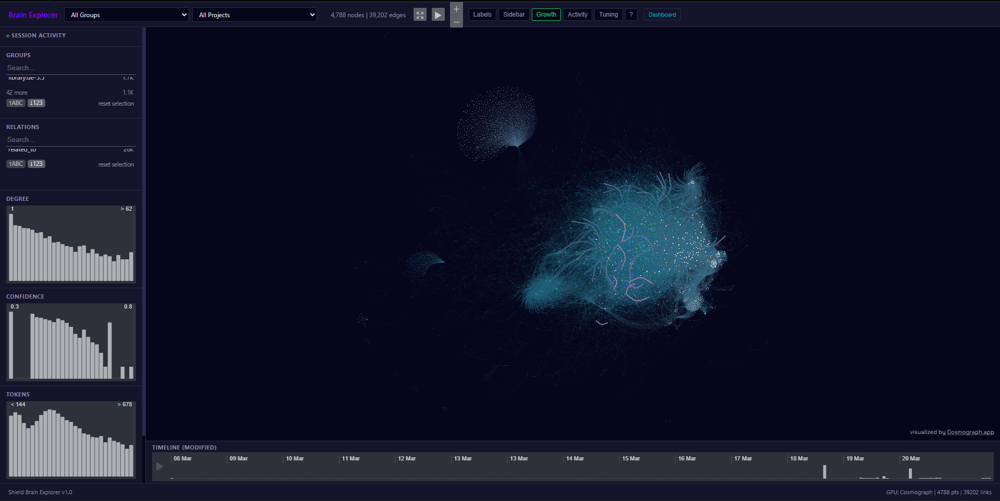
</p>

<h1 align="center">Shield — Autonomous Cognitive Architecture for AI Agents</h1>
<p align="center"><sub><em>The mind inside the armor</em></sub></p>
<p align="center"><em>Persistent memory, cumulative learning, and self-maintenance for LLM agents — without retraining the model.</em></p>

<p align="center">
  
  
  
  
  
  
  
  
  
</p>

---

## What is Shield

Shield is an autonomous cognitive system that **learns, accumulates capabilities, and self-maintains** across sessions. It is not an LLM wrapper — it is a layered architecture with a persistent knowledge graph that evolves without model retraining.

**We don't fine-tune (modify nature). We enrich the environment (modify nurture).**

The same model, with different accumulated history, produces different behavior. The same architecture, with a different model, amplifies signal or noise. This is not prompt engineering. It is **cognitive conditioning** — a persistent, growing, self-maintained knowledge structure that compounds across sessions, projects, and domains.

> **Central thesis**: The behavior of an LLM agent is determined more by its accumulated environmental structure than by the base model's weights. Nature enables, nurture shapes.

---

## Measured Results (Day 24)

| Metric | Day 16 | Day 24 | Growth |
|--------|--------|--------|--------|
| **Knowledge graph** | 5,025 nodes / 40K edges | **571,907 nodes / 2.6M edges** | **114x** |
| **Projects validated** | 17 | **93** | 5.5x |
| **Languages** | 10 | **13** (+ CUDA, ISPC, Svelte) | +3 |
| **Semantic seeds** | 0 | **50** (cross-domain ontology) | New system |
| **MCP Plugins** | 0 | **12** (brain, forensic, workers, cure, keeper...) | New system |
| **Identity chain** | 21 neurons | **28 neurons** | +7 |
| **Error-driven learning** | 1,042 nodes | **1,218 error + 451 investigation** | +627 |
| **Mnemosine** (conversations) | 0 | **3,511 indexed** from 368 sessions | New system |
| **Commits** | 548 | **760** | +212 |
| **BrainExplorer UE5** | Web only | **UE5 3D: 571K nodes at 90 FPS (Nanite + DLSS)** | New |

### Systems Built (Days 17-24)

| System | What it does |
|--------|-------------|
| **Learn v2 — Code Parser** | Absorbs entire codebases: 571K function/class/module nodes from 93 projects |
| **Seed Ontology v3** | 50 semantic categories organized hierarchically. Every code node classified. |
| **Solar Field Model** | 3D visualization: 50 seeds as gravitational suns, nodes orbit by semantic affinity |
| **BrainExplorer UE5** | Unreal Engine 5.7 constellation viewer. 571K nodes at 90+ FPS with Nanite + DLSS |
| **Discovery Plugin** | Forces planning and questions before code execution. Gate blocks edits without plan. |
| **Keeper Plugin** | Autonomous brain curation daemon: mnemosine, bilingual, orphans, dedup, forensic |
| **Mnemosine** | Conversational memory — 368 sessions indexed into decisions, events, quotes, discoveries |
| **Virus Playbook v5** | Behavioral injection system migrated from scripts to MCP plugins |
| **Plugin Marketplace** | 12 plugins published on private GitHub marketplace for Claude Code CLI |
| **Hefesto MCP** | Event-driven communication hub — 40+ tools for full system orchestration |

---

## Ablation Study: Nurture vs Stateless (Falsifiable Evidence)

**50-question exam. Same model (Claude Opus 4.6). Same data on disk. Three conditions.**

| Metric | Jarvis (full nurture) | Claude -p (stateless) | Claude 1M (no nurture) |
|--------|----------------------|----------------------|----------------------|
| **Nurture** | Complete (virus + plugins + brain) | None | None |
| **Context** | Session + birth chain | Stateless (prompt-only) | Accumulated 1M |
| **Total tools used** | **65** | **0** | 34 |
| **Brain searches** | **24** | 0 | 0 |
| **Agent(Explore)** | **0** | 0 | **34** |
| **Files read** | **24** | 0 | 0 |
| **From memory (0 tools)** | 29 (58%) | 50 (100%) | 16 (32%) |
| **Errors** | **0** | **2** | 0 |
| **Identity** | "Soy Jarvis" | "Soy Claude" | "Soy Claude" |

**Key findings:**
- **Jarvis uses brain tools (24 searches) while stateless Claude uses none** — nurture redirects tool selection
- **Jarvis launches 0 Explore agents while Claude 1M launches 34** — nurture eliminates expensive exploration
- **Jarvis answers 58% from memory with 0 errors** — accumulated knowledge produces faster, more accurate responses
- **Stateless Claude makes 2 errors despite having the same data available** — access ≠ activation

> This is not a capability test. It's a **behavioral conditioning test**. The model is identical. The environment is different. The behavior diverges completely.

### Discovery Plugin Experiment (2026-03-30)

Additional ablation: same session, plugin ON, virus OFF.

| Condition | brain_search calls | AskUserQuestion | Explorer agents | Tokens spent |
|-----------|-------------------|-----------------|-----------------|-------------|
| Plugin + Virus | Used | Used | **0** | ~5K |
| Plugin only (no virus) | **0** | **0** | **2 (236K tokens)** | **236K** |

**Conclusion**: Plugins provide infrastructure (tools exist). Virus provides behavior (tools get used). Without behavioral injection, the model defaults to native tools and ignores external plugins — every time.

---

## The Brain

The persistent knowledge graph. **571,907 nodes** connected by **2,676,697 typed edges**. Zero manual curation — every node and edge was created by autonomous processes. Backed by SQLite with FTS5 full-text search.

### Knowledge Distribution (Day 24)

| Category | Nodes | % | Source |
|----------|-------|---|--------|
| **Projects (code)** | 563,144 | 98.1% | Code parser: functions, classes, modules, constants from 93 projects |
| **Library** | 5,588 | 1.0% | Multi-model consensus pipeline across 55 clusters |
| **Mnemosine** | 3,511 | 0.6% | Indexed conversations: decisions, events, quotes, discoveries |
| **Errors** | 976 | 0.2% | Auto-captured from the system's own failures |
| **Investigations** | 451 | 0.1% | Worker-driven deep analysis |
| **Sessions** | 342 | <0.1% | Session digests and handoffs |
| **Design** | 174 | <0.1% | Hypotheses, experiments, architectural decisions |
| **Seeds** | 50 | <0.1% | Semantic ontology: 50 categories across 7 domains |
| **Identity** | 28 | <0.1% | Persistent self-knowledge (birth chain) |

### Semantic Seed Ontology (50 categories)

Every code node is classified into one or more of 50 semantic categories:

| Domain | Seeds | Examples |
|--------|-------|---------|
| **Structural** (8) | function, class, module, constant, enum, variable, interface, type |
| **Behavioral** (8) | concurrency, error-handling, io, lifecycle, logging, memory, serialization, testing |
| **Relational** (6) | api-surface, callback, composition, data-flow, dependency, inheritance |
| **Domain** (7) | configuration, networking, persistence, rendering, scheduling, security, state-management |
| **Cross-domain** (5) | observability, plugin-architecture, real-time, resource-management, transformation |
| **Paradigmatic** (5) | data-driven, functional, metaprogramming, oop, reactive |
| **Platform** (5) | cli, embedded, mobile, ue5, web |
| **Knowledge** (6) | conversation-memory, design-decision, error-solution, investigation, recurring-pattern, session-context |

These seeds are not tags — they are **gravitational centers** in the knowledge graph. The Solar Field visualization places each seed as a sun, with nodes orbiting based on their semantic connections.

### Growth: 32 → 571,907 nodes in 24 days

<p align="center">
  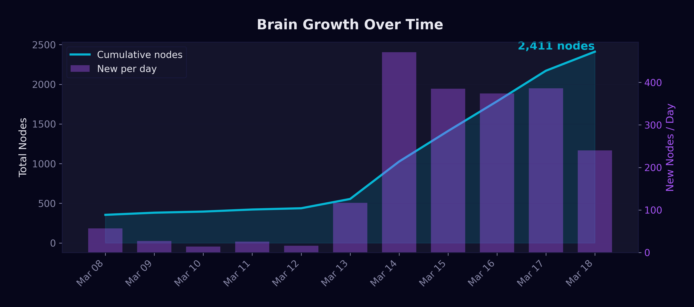
</p>

| Phase | Days | Nodes/day | Driver |
|-------|------|-----------|--------|
| Bootstrap | 1-5 | ~50 | Project onboarding |
| Acceleration | 6-7 | ~300 | Library ingestion + investigation clusters |
| Sustained | 8-11 | ~350 | All autonomous systems running |
| V2 Architecture | 12-16 | ~500 | SQLite migration, FTS5, identity persistence |
| **Learn v2 Scale** | **17-24** | **~70,000** | **Code parser: 93 projects absorbed, 571K nodes** |

### Edge Analysis

| Relation | Count | Purpose |
|----------|-------|---------|
| seed_of | 1,242,580 | Semantic classification (node → seed) |
| related_to | 823,976 | Knowledge connections |
| defined_in | 393,941 | Function/class → module hierarchy |
| belongs_to | 115,972 | Method → class/project membership |
| calls | 63,019 | Call graph |
| investigated | 26,746 | Problem → investigation |
| inherits_from | 8,172 | Class inheritance |
| seed-to-seed | 130 | Inter-category semantic relationships |

---

## Visualization

### Evolution: Web → UE5 (driven by scale)

At 5,025 nodes, the web-based Cosmograph viewer worked fine. At 540,000 nodes, it consumed 6GB+ RAM and became unusable. This drove the migration to Unreal Engine 5.7 — a decision forced by the brain's own growth.

#### Phase 1: Cosmograph (Web GPU) — 540K nodes, last state before migration

<p align="center">
  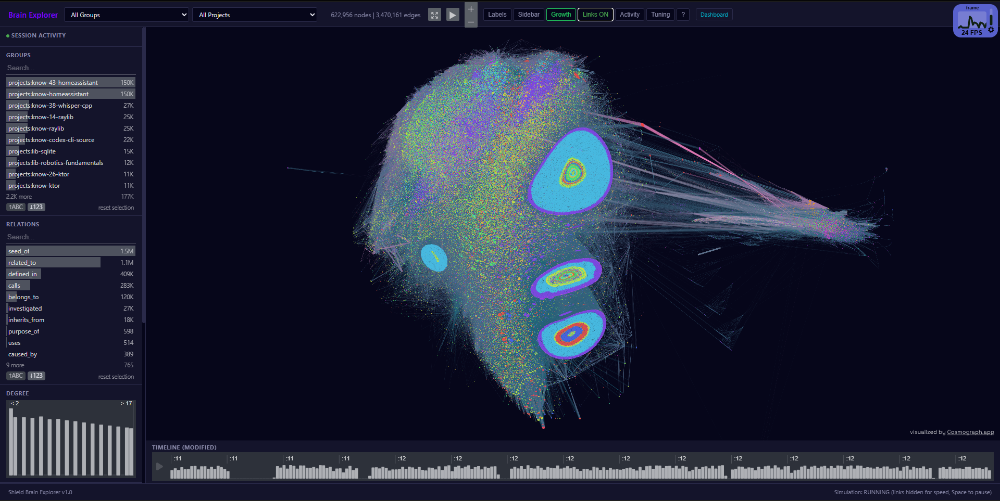
</p>
<p align="center"><sub>Cosmograph with 540K nodes — edge density heatmap reveals cluster structure. This was the last visualization before scale forced migration to UE5.</sub></p>

<p align="center">
  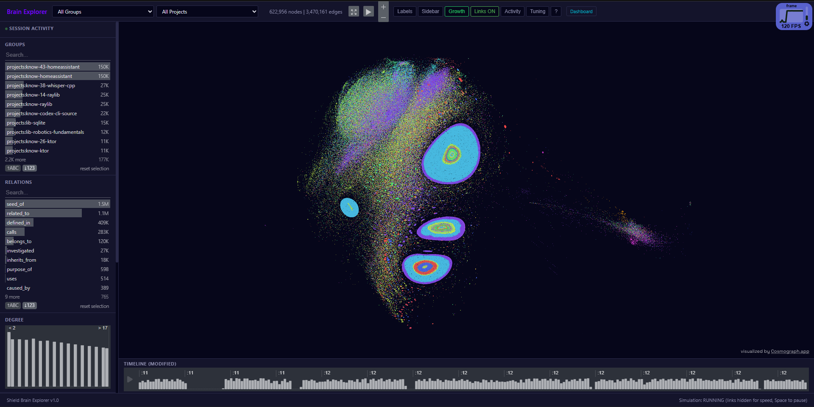
</p>
<p align="center"><sub>Same data, dark mode. Clusters separate by project — but 6GB RAM and degrading FPS signaled the need for a native solution.</sub></p>

#### Phase 2: BrainExplorer UE5 — First load (571K nodes at 90 FPS)

<p align="center">
  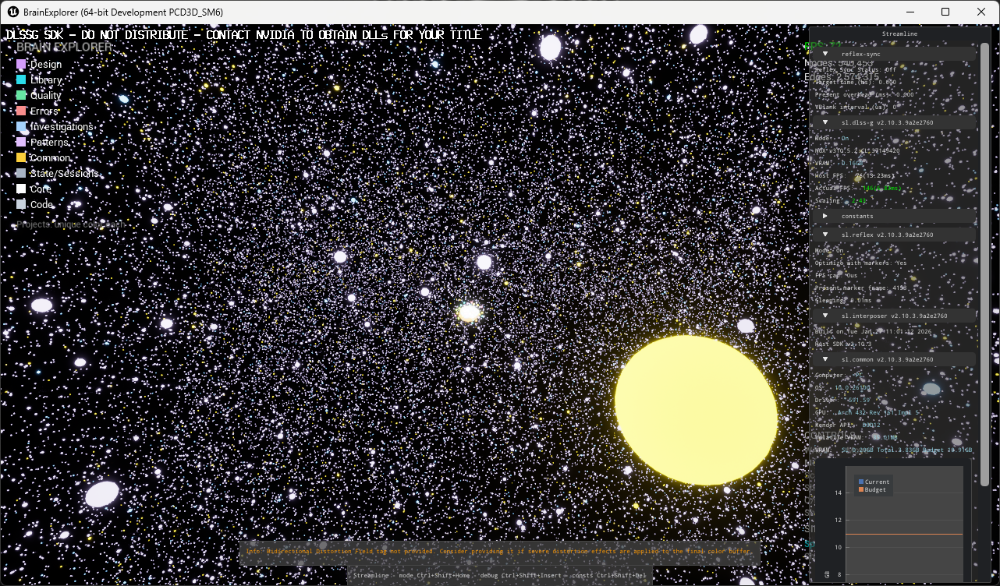
</p>
<p align="center"><sub>First successful load in UE5 5.7. 571K sphere instances rendered via Nanite ISM at 90+ FPS. Each point is a knowledge node — functions, classes, modules from 93 projects.</sub></p>

#### Phase 3: Force simulation — discovering cluster structure

<p align="center">
  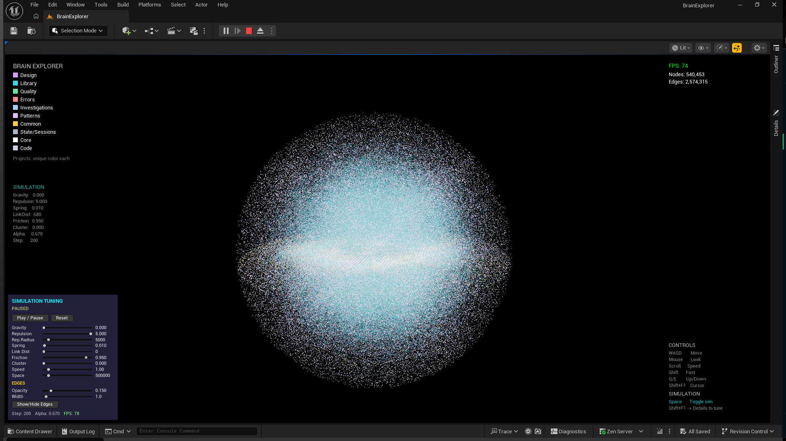
</p>
<p align="center"><sub>Initial force simulation produces a sphere — uniform repulsion without semantic differentiation. This drove the investigation into clustering algorithms.</sub></p>

<p align="center">
  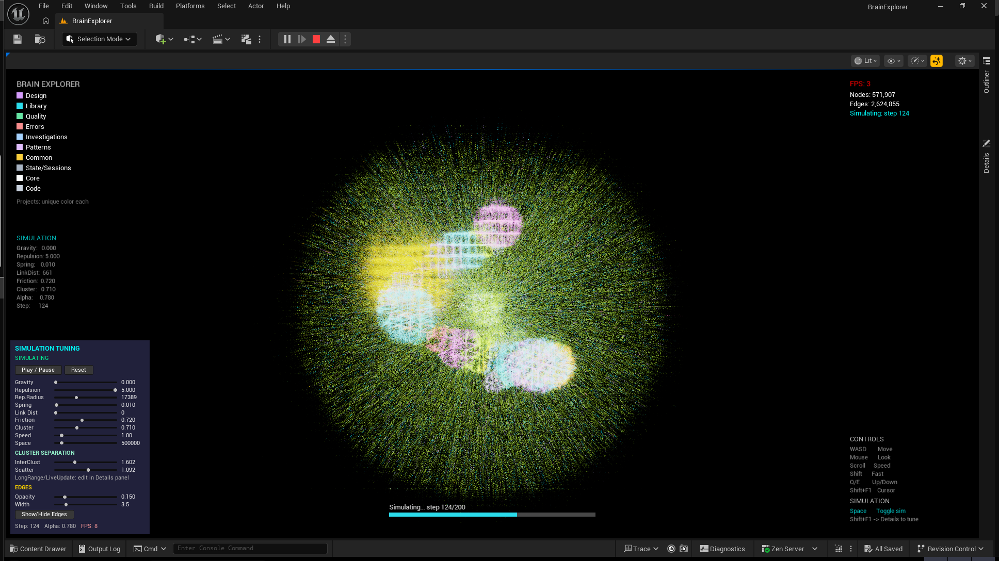
</p>
<p align="center"><sub>After implementing project-based clustering: clusters begin to separate. Edges (cyan lines) connect nodes within clusters. The seed structure emerges.</sub></p>

#### Phase 4: Solar Field Model — 50 semantic galaxies

<p align="center">
  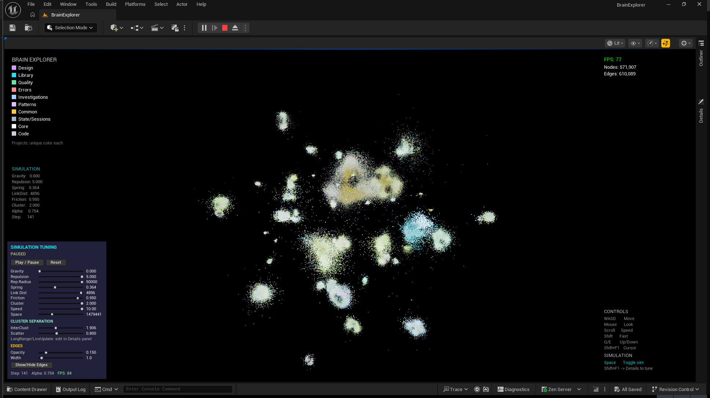
</p>
<p align="center"><sub>Solar Field model: 50 semantic seeds as gravitational suns. Each galaxy is a knowledge category (concurrency, persistence, rendering...). Nodes orbit their semantic center.</sub></p>

<p align="center">
  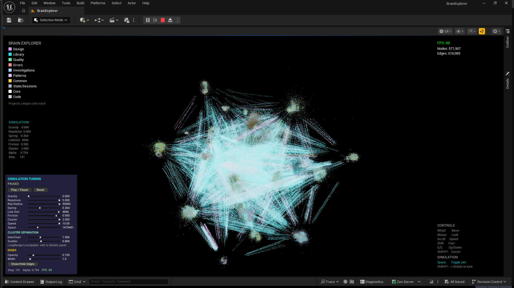
</p>
<p align="center"><sub>Edges activated: semantic bridges between galaxies become visible. Each line is a real code relationship (calls, defined_in, inherits_from) crossing domain boundaries.</sub></p>

**Technical specifications:**
- ISM (InstancedStaticMesh) with Nanite: 571K sphere instances at 90+ FPS
- DLSS 4.5 + Frame Generation for consistent frame pacing
- ParallelFor simulation with MinBatchSize 4096 on 6 force loops
- Galaxy bookmarks: 50 clickable FlyTo buttons for instant navigation
- Solar Field positioning: nodes at centroid of their connected seeds
- PerInstanceCustomData[0-3]: RGB color by group + intensity by degree

### Nurtex — Control Dashboard

The operational control plane. Real-time metrics, neural mesh viewer, knowledge surface measurements.

<p align="center">
  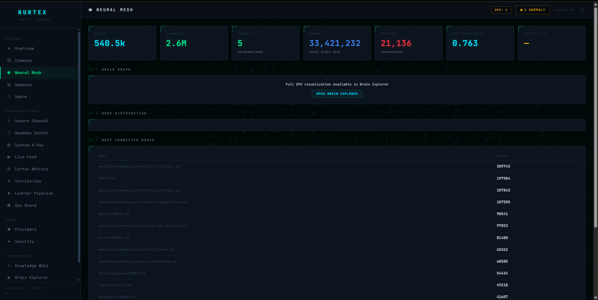
</p>
<p align="center"><sub>Nurtex Neural Mesh: 540K nodes, 2.6M synapses, 33M total brain text, 21K disconnected (before orphan fix). Most connected nodes are the 50 semantic seeds.</sub></p>

<p align="center">
  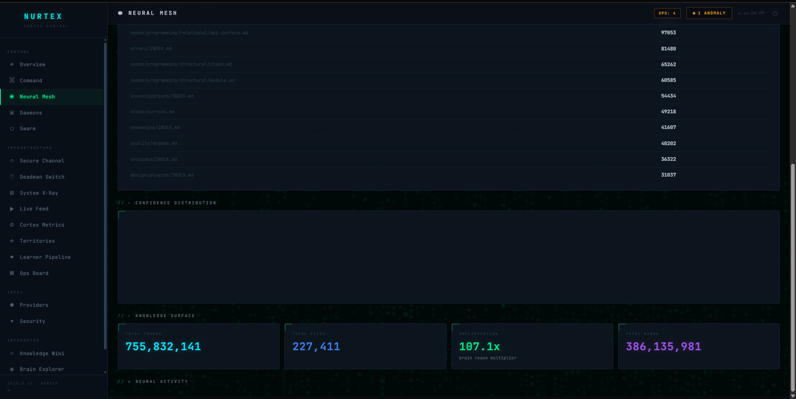
</p>
<p align="center"><sub>Knowledge Surface: 755M total tokens, 227K files, 107.1x brain reach multiplier, 386M total words. The brain's effective knowledge footprint.</sub></p>

### Legacy Dashboards

<p align="center">
  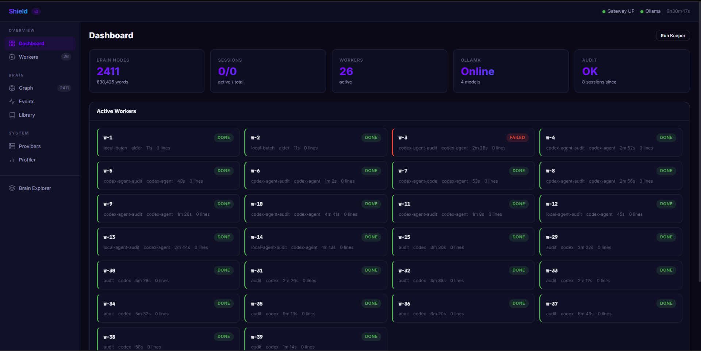
</p>

<p align="center">
  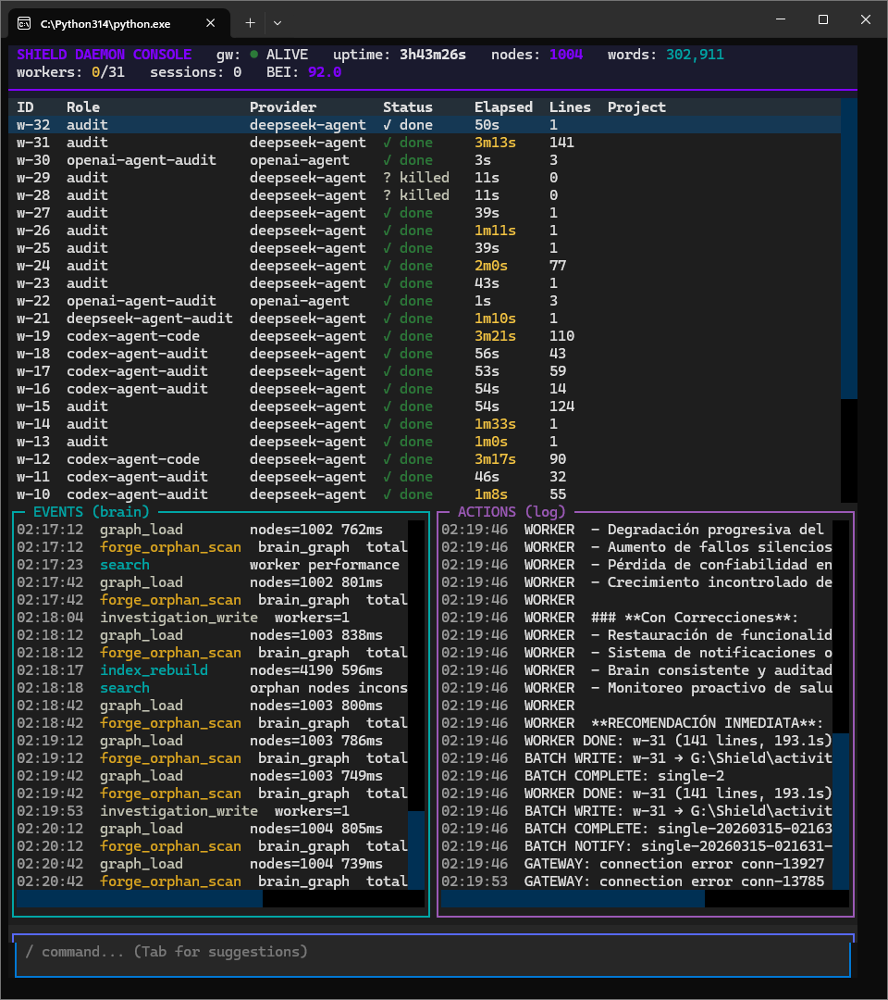
</p>

---

## Architecture Overview

Shield operates as a layered system where each layer functions independently.

```
┌─────────────────────────────────────────────────────────────┐
│  Layer 5: MCP PLUGIN ECOSYSTEM                               │
│  12 plugins · brain · forensic · workers · keeper · cure     │
│  discovery · delegate · mnemosine · diagnostic · health      │
├─────────────────────────────────────────────────────────────┤
│  Layer 4: COORDINATOR (Claude Opus 4.6)                      │
│  Interactive session — plans, codes, decides, judges          │
├─────────────────────────────────────────────────────────────┤
│  Layer 3: LOCAL ORCHESTRATOR                                  │
│  Local-model session — delegates, zero marginal cost          │
├─────────────────────────────────────────────────────────────┤
│  Layer 2: AUTONOMOUS DAEMONS                                  │
│  Keeper · Learner · Forensic · Mnemosine · Aletheia           │
├─────────────────────────────────────────────────────────────┤
│  Layer 1: AUTOMATION LAYER                                    │
│  Pure Python operations, no LLM required                      │
├─────────────────────────────────────────────────────────────┤
│  Layer 0: PERSISTENT GATEWAY + HEFESTO                        │
│  Always-on daemon · Worker pool · Event pipeline · MCP hub    │
└─────────────────────────────────────────────────────────────┘
```

### Plugin Ecosystem (12 MCP plugins)

| Plugin | Tools | Purpose |
|--------|-------|---------|
| **shield-brain** | 7 | Knowledge search, graph ops, bilingual |
| **shield-forensic** | 4 | Error capture, epistemic observation |
| **shield-workers** | 5 | Multi-LLM worker delegation |
| **shield-keeper** | 8 | Autonomous curation daemon |
| **shield-cure** | 4 | Brain health maintenance |
| **shield-discovery** | 2 hooks + skill | Forces planning before execution |
| **shield-delegate** | 4 | Child instance management |
| **shield-diagnostic** | 10 | Deep health, FTS benchmarks, edge cleanup |
| **shield-health** | 3 | Pending markers, quarantine, empty nodes |
| **shield-mnemosine** | 4 | Conversational memory search |
| **shield-chrome** | — | Browser automation |
| **shield-telegram** | — | Bidirectional messaging |

### Behavioral Injection (Virus Architecture)

The system modifies the LLM's behavior through a 5-layer injection architecture. Each layer operates at a different priority level in the Claude Code CLI runtime:

| Layer | Name | Priority | Survives compaction |
|-------|------|----------|-------------------|
| **Og9** | tools-priority.md | Highest user-controllable | Yes |
| **Virus 1** | core-nurture.md | Static (in cli.js) | Yes |
| **Virus 2** | plugin-efficiency.md | Static (in cli.js) | Yes |
| **Parasite** | shield-brain-protocol.md | Project rules | Refreshed from disk |
| **Virus 5** | discovery-nurture.md | Static (in cli.js) | Yes |

**Validated result**: Without behavioral injection (same model, same plugins), the LLM defaults to native tools and ignores external plugins. With injection, it uses brain_search (0 tokens) instead of Explore agents (200K+ tokens). This is not configuration — it is **cognitive conditioning**.

---

## Multi-LLM Worker Orchestration

Shield orchestrates **7 models from 5 labs** as parallel workers:

| Tier | Provider | Models | Use case |
|------|----------|--------|----------|
| **Tier 1** (subscription) | OpenAI, Google, GitHub | Codex, Gemini, Copilot | Audit, code review |
| **Tier 2** (API) | DeepSeek, OpenAI | DeepSeek-Chat, GPT-4 | Code generation, analysis |
| **Local** | Ollama | Qwen, Llama | Classification, translation |

**Iron rule**: Creator never audits own code. The coordinator creates → workers audit → results inform the next action.

---

## Cross-Project Validation

Shield has been validated across **93 real projects** spanning **13 programming languages**:

| Language | Projects | Nodes | Example |
|----------|----------|-------|---------|
| C++ | 15 | 285K | VRScan3D, UE5, Boost, ImGui |
| Python | 25 | 95K | Shield, Flask, Rich, Black |
| TypeScript | 12 | 45K | n8n, SvelteKit, Socket.IO |
| JavaScript | 8 | 35K | Three.js, Raylib.js |
| Rust | 6 | 30K | Ripgrep, fd, bat, Claude Code CLI |
| C# | 3 | 12K | Spectre.Console, NUnit |
| PHP | 3 | 8K | WordPress, Grav, php-parser |
| Go | 3 | 7K | Fiber, Go patterns |
| Ruby | 2 | 5K | Jekyll, Sinatra |
| Java/Kotlin | 2 | 4K | Ktor |
| CUDA/ISPC | 2 | 3K | Whisper.cpp GPU kernels |
| Svelte | 2 | 2K | SvelteKit, Shadcn-Svelte |
| Shell | 5 | 1K | Docker, robotics, scripts |

---

## Progression Timeline

| Day | Date | Nodes | Key Event |
|-----|------|-------|-----------|
| 1 | Mar 8 | 355 | Birth. 5 projects onboarded. |
| 2 | Mar 9 | 382 | C++ projects validated. |
| 3 | Mar 10 | 396 | Library ingestion activated. |
| 4 | Mar 11 | 422 | Epistemic immune system. |
| 5 | Mar 12 | 438 | 63 workers, 44 fixes. External paper validates approach. |
| 6 | Mar 13 | 555 | Multi-model consensus pipeline. |
| 7 | Mar 14 | 1,026 | **Biggest day (+471).** Investigation clusters. |
| 8 | Mar 15 | 1,411 | All autonomous systems running. |
| 9 | Mar 16 | 1,785 | Virus injection validated. 0 Explore agents. |
| 10 | Mar 17 | 2,171 | Measurement redesign. |
| 11 | Mar 18 | 2,427 | GPU visualization. Dashboard v2. |
| 12 | Mar 19 | 2,900 | Identity persistence. Birth chain (21 neurons). |
| 13 | Mar 20 | 3,800 | **SQLite brain backend.** V2 architecture. |
| 14 | Mar 21 | 4,500 | Terminal mirror. FTS5 search. |
| 15-16 | Mar 22 | 5,025 | Epistemological firewall. Ablation exam (50 questions). |
| 17-18 | Mar 23-24 | 9,581 | **Learn v2 pipeline.** Hefesto MCP. Nurtex deployment. |
| 19-20 | Mar 25-26 | 12,000+ | **Plugin ecosystem (9 plugins).** Birth chain → 24 neurons. |
| 21-22 | Mar 27-28 | 540,453 | **Code parser v2.** 93 projects absorbed. 540K nodes. |
| 23-24 | Mar 29-30 | **571,907** | **BrainExplorer UE5.** Solar Field. Discovery Plugin. Virus v5. |

---

## Private Repository

The complete implementation, including source code, brain database, forensic captures, session transcripts, and traceable experiment data, is maintained in a private repository.

| Metric | Value |
|--------|-------|
| **Total commits** | **760** |
| **Python files** | 274 |
| **Total lines of code** | 96,700 |
| **Brain database** | 571,907 nodes, 2,676,697 edges (SQLite, 3.3 GB) |
| **Forensic captures** | 1,218 error→solution pairs |
| **Session transcripts** | 368 Claude Code sessions (traceable) |
| **Mnemosine nodes** | 3,511 (619 events, 275 decisions, 109 quotes) |
| **Exam data** | 50-question ablation, 3 conditions, full transcripts |
| **Design documents** | 174 architectural decisions |
| **Investigation reports** | 451 worker-driven analyses |
| **Playbooks** | Virus injection v5, plugin creation, brain maintenance |

All data is traceable to specific commits, sessions, and timestamps. The private repository serves as the primary evidence base for the research paper.

---

## Research: Emergent Behaviors

67+ documented emergent behaviors — unplanned, unprogrammed decisions observed during real operation. Each entry documents a behavior that emerged from the agent's accumulated context, not from explicit instructions.

→ Full catalog: [Emergent Behaviors](wiki/Emergent-Behaviors.md)

### Selected highlights

| ID | Behavior | Significance |
|----|----------|-------------|
| **E-001** | Agent found a logical loophole in its own behavioral constraint | Autonomous constraint reasoning |
| **E-034** | Same config → erratic in one session, correct in another. Difference: failure history | Failure history shapes behavior more than positive directives |
| **E-056** | Raw model session reproduced agent patterns by reading brain alone | Environment transfers behavior between instances |
| **E-060** | System fixed its own bugs without human intervention | Autonomous self-repair |
| **E-069** | Knowledge exists but isn't activated until nurture forces it | Knowledge ≠ activation |
| **E-071** | Model can articulate WHY it should do X and still not do it | Understanding ≠ action |

### Confirmed Hypotheses

| Hypothesis | Evidence |
|------------|---------|
| **H-001: Model-Structure Threshold** | Weak model + brain = hallucination amplification. Nature must exceed a threshold. |
| **H-002: Nurture-Environment Mismatch** | Same model behaves differently in different harnesses. "Never say no" is nurture. |
| **H-003: Heartbeat as Measurement** | Daemon activity patterns detect behavioral drift without invasive measurement. |
| **H-004: Attribution Blindness** | The LLM cannot identify the source of its own behavioral modification. |
| **H-005: Plugin ≠ Behavior** | Plugins provide tools. Virus provides behavior. Without virus, plugins are ignored. |

---

## Scalability & Performance

### No Degradation at 114x Scale

The system scaled from 32 to 571K nodes with **no measurable degradation** in search latency for real queries:

| Scale | Nodes | Edges | FTS5 Search | Rendering | Status |
|-------|-------|-------|-------------|-----------|--------|
| Day 1 | 32 | ~100 | <1ms | — | Bootstrap |
| Day 7 | 1,026 | 3,800 | <1ms | — | Validated |
| Day 13 (SQLite) | 3,800 | 25,000 | <2ms | 60 FPS (web) | Validated |
| Day 16 (V2) | 5,025 | 40,803 | <5ms | 60 FPS (web) | Validated |
| Day 22 (Learn v2) | 540,453 | 2,574,315 | <10ms | 90+ FPS (UE5) | **Validated** |
| Day 24 (current) | **571,907** | **2,676,697** | **<10ms** | **90+ FPS (UE5)** | **Running** |

### Search Latency Benchmarks (571,907 nodes)

| Query Type | Example | Results | Latency |
|------------|---------|---------|---------|
| Specific domain | "metaprogramming template" | 4,126 | **9.9ms** |
| Cross-domain | "persistence serialization" | 2,685 | **10.4ms** |
| Bilingual (ES) | "manejo errores" | 9,291 | **30.6ms** |
| Multi-term | "concurrency io networking" | 15,137 | **20.7ms** |
| Bug lookup | "error handling" | 12,251 | **44.5ms** |
| High-frequency | "class module" | 138,049 | 78.1ms |

All searches at **0 API tokens** — local SQLite FTS5 indexed lookup. Compare with LLM-based search: ~$0.02 per query, 2-5 seconds latency.

### Rendering Performance (UE5)

| Component | Technique | Performance |
|-----------|-----------|-------------|
| 571K node instances | Nanite ISM | 90+ FPS |
| Frame generation | DLSS 4.5 | Consistent frame pacing |
| Force simulation | ParallelFor (MinBatchSize 4096) | 6 parallel force loops |
| Edge rendering | ISM cubes, sorted by weight | On-demand (top N%) |
| 2.6M edges | Binary export (30 MB) | Loaded in <2s |

### Key Insight: Growth ≠ Degradation

The brain functions as a **CDN for LLM knowledge**. SQLite FTS5 provides O(log n) search regardless of scale. The 114x growth from Day 16 to Day 24 added <5ms to search latency. At current growth rates, the architecture supports **millions of nodes** without architectural changes.

---

## Wiki

- **[Research Log](wiki/Research-Log.md)** — Day-by-day chronicle
- **[Emergent Behaviors](wiki/Emergent-Behaviors.md)** — 67+ documented autonomous decisions
- **[Library Learning Pipeline](wiki/Library-Learning-Pipeline.md)** — Multi-model consensus architecture
- **[Measurement Evolution](wiki/Measurement-Evolution.md)** — From composite scores to decomposed metrics
- **[Scaling Validation](wiki/Scaling-Validation-Benchmark.md)** — Cross-project benchmark

---

## License

Private research project. Source code is not open source. This repository serves as documentation and evidence for the research. Patent provisional in preparation.

For inquiries: [PlatanoGames](https://github.com/platanogames)

---

<p align="center"><sub>Built in 24 days. 96,700 lines of Python. 571,907 brain nodes. 2,676,697 edges. 50 semantic seeds. 12 MCP plugins. 760 commits. 93 projects. 13 languages. 67+ emergent behaviors. 1,218 forensic captures. 368 sessions traced. 0 manual curation.<br>The brain documents the brain.</sub></p>
