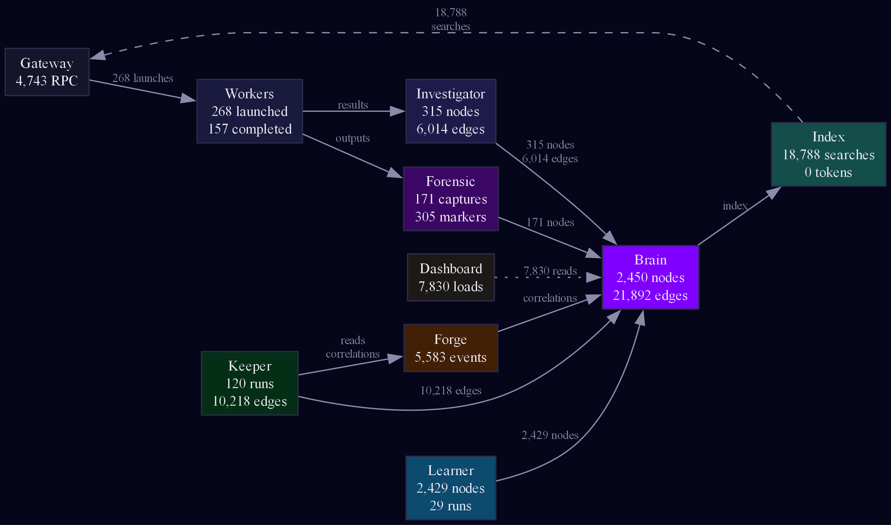
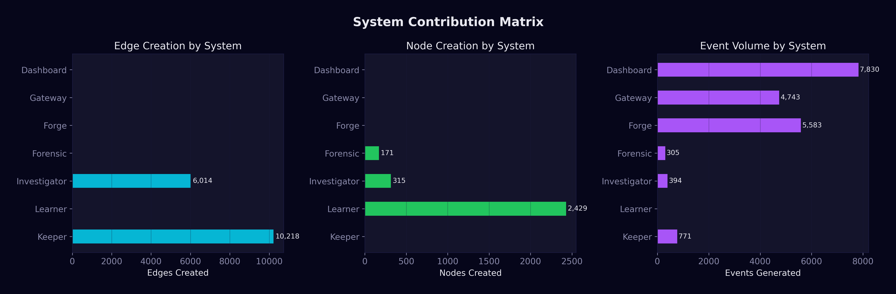
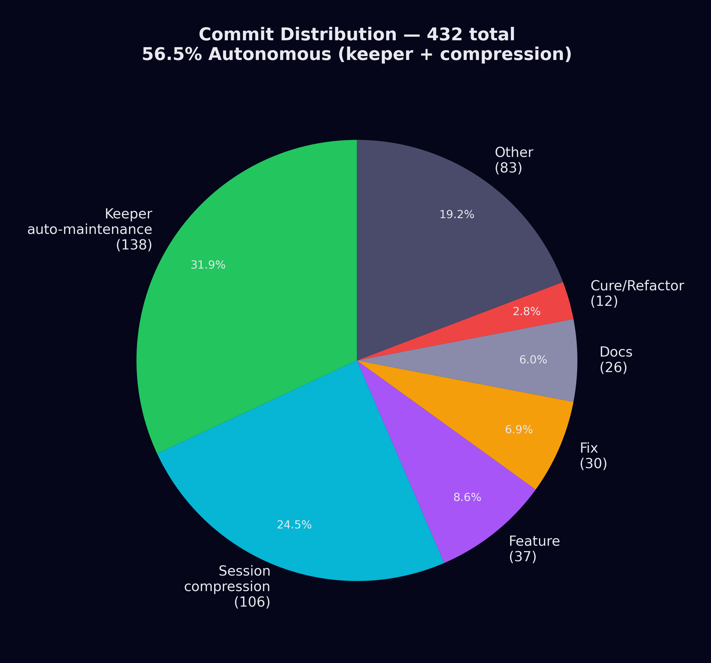
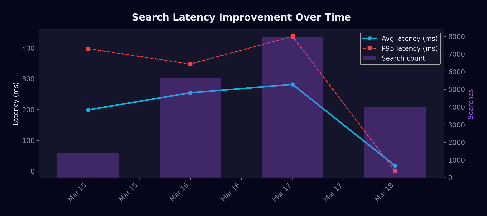
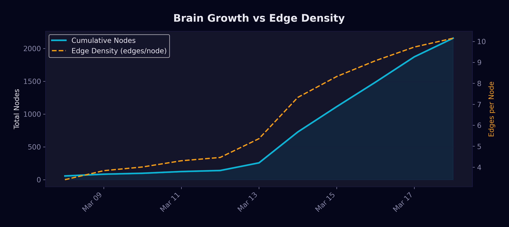
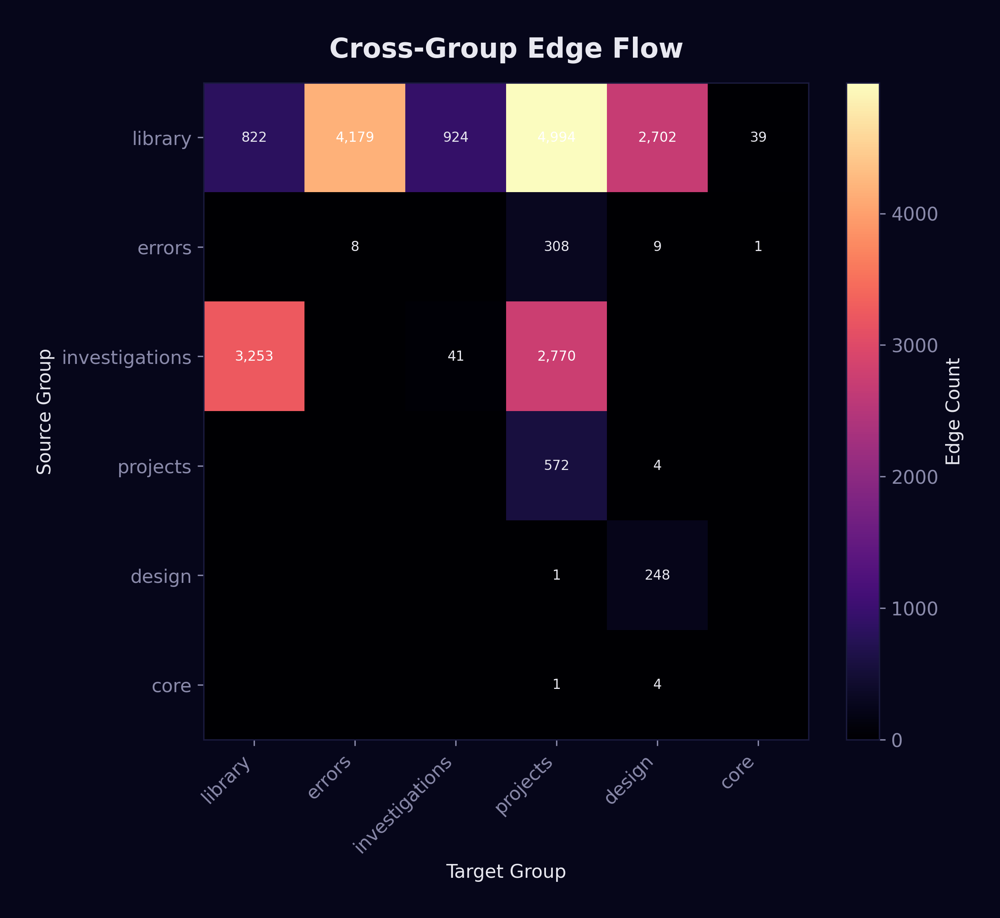

<p align="center">
  
</p>

<h1 align="center">Shield — Autonomous Software Analysis System</h1>

<p align="center">
  
  
  
  
  
  
  
</p>

<p align="center"><em>The image above is not a rendering. It is a live GPU visualization of 2,427 knowledge nodes and 21,460 edges — built autonomously in 11 days without manual curation.</em></p>

---

## What is Shield

Shield is an autonomous cognitive system that **learns, accumulates capabilities, and self-maintains** analogously to human learning. It is not an LLM wrapper — it is a 5-layer architecture with a persistent knowledge graph that evolves across sessions without model retraining.

**We do not fine-tune (modify nature). We enrich the environment (modify nurture).**

The same model, with different accumulated history, produces different behavior. The same architecture, with a different model, amplifies signal or noise. This is not prompt engineering (a single instruction). It is **cognitive conditioning** — a persistent, growing, self-maintained knowledge structure that compounds across sessions, projects, and domains.

### Central Thesis: Nurture Over Nature

<sub>First committed: 2026-03-06 · Empirically confirmed: 2026-03-09 (E-034) · Formalized: 2026-03-12 (H-001, H-002)</sub>

> **The behavior of an LLM agent is determined more by its accumulated environmental structure than by the base model's weights.**

**Empirical evidence:**

- **E-034** (2026-03-09): Same configuration produced erratic behavior in one session set and correct behavior in another. The difference: accumulated failure documentation + quantified consequences. *Failure history shapes behavior more than positive directives.*
- **E-056** (2026-03-12): A raw LLM session (no harness, no automation) reproduced the orchestrator's behavioral patterns simply by reading the brain. *The environment transfers behavior across instances.*
- **H-001** (confirmed N=5, 2026-03-14): Same architecture + capable model = 0% erratic. Same architecture + weaker model = 71% hallucination. The brain amplifies whatever the model provides — signal or noise. *Nature enables, nurture shapes. But nature must clear a threshold for nurture to work.*
- **H-002** (confirmed with code evidence, 2026-03-14): The same set of directives produces **opposite pathologies** in different environments. In a competitive environment, strong directives help. In a zero-competition environment, the same directives cause over-compliance. *Directive pressure must be proportional to competing forces.*

This thesis predates and is independent of any concurrent work on LLM environmental conditioning. Design documents, commit history, and the emergent behavior log provide full traceability from initial hypothesis (Day 1) through empirical confirmation (Days 4-9).

> Full research log, metrics, and emergent behavior catalog in the **[Wiki](https://github.com/platanogames/shield-project/wiki)**.

---

## Measured Results (Day 11 — March 18, 2026)

<p align="center">
  
  <br><em>Brain Explorer — 2,427 nodes and 21,460 edges rendered at 60fps on GPU (Cosmograph v2).</em>
</p>

| Metric | Value | Source |
|--------|-------|--------|
| **Brain** | **2,427 nodes**, 21,460 edges, 7,252 keywords | Graph snapshot (2026-03-18) |
| **Search hit rate** | **98%** (18,757 / 19,069 hits) | Brain event logs (42,746 events) |
| **Brain operations** | **18,778 searches** at **0 tokens each** | Local TF-IDF — no API calls |
| **Cognitive leverage** | **96%** (~100K+ tokens saved via reuse) | Session metrics |
| **Emergent behaviors** | **62 documented** (54 E + 4 X + 4 H) | Emergent behaviors log |
| **Workers launched** | **500+** across 14 projects | Worker event logs (268 launch events) |
| **Languages validated** | **8** (Python, C++, PHP, JS, TS, Rust, Go, Java) | Cross-project tests |
| **LLM backends** | **7 models** from 5 labs | Provider health checks |
| **Error-driven nodes** | **713** (402 errors + 311 investigations) | Brain graph query |
| **Library knowledge** | **1,392 nodes** from 26 libraries via 7-model consensus | Learner pipeline logs (6,450 events) |
| **Forensic captures** | **171** error→solution pairs (81 HIGH, 75 MEDIUM, 15 LOW) | Forensic JSONL |
| **Commits** | **431** in 13 days | Git log |
| **Core codebase** | **62,814 lines** Python | Source count |
| **Cost per session** | **<$0.50** (expensive model does <1% of work) | Token accounting |

### How the brain grew: 32 → 2,427 nodes in 11 days

<p align="center">
  
  <br><em>Cumulative node count (cyan) and daily additions (purple). Three phases: bootstrap (Days 1-5, ~50/day), acceleration (Days 6-7, ~400/day), sustained (Days 8-11, ~350/day).</em>
</p>

| Day | Date | Nodes | Key Event |
|-----|------|-------|-----------|
| 1 | Mar 8 | 355 | Birth. 5 projects onboarded in one session. |
| 2 | Mar 9 | 382 | C++ projects enter (Unreal Engine 5). |
| 3 | Mar 10 | 396 | Library Learner pipeline activated. |
| 4 | Mar 11 | 422 | Epistemic integrity experiments begin. |
| 5 | Mar 12 | 438 | 63 workers, 44 code fixes in one day. |
| 6 | Mar 13 | 555 | 7-model consensus pipeline operational. |
| 7 | Mar 14 | **1,026** | **+471 nodes.** Investigation Cluster born. H-002 confirmed. |
| 8 | Mar 15 | 1,411 | All autonomous daemons running simultaneously. |
| 9 | Mar 16 | 1,785 | Steady-state operations. |
| 10 | Mar 17 | 2,171 | BEI composite metric formally deprecated. |
| 11 | Mar 18 | **2,427** | Brain Explorer (GPU). Dashboard v2. This document. |

---

## Architecture

```
┌─────────────────────────────────────────────────────────────┐
│  Layer 4: COORDINATOR (Claude Opus 4.6, 1M context)         │
│  Plans, codes, decides, judges. <1% of total compute.       │
├─────────────────────────────────────────────────────────────┤
│  Layer 3: LOCAL ORCHESTRATOR (Ollama, zero cost)             │
│  Orchestrates, delegates, classifies. Local inference.       │
├─────────────────────────────────────────────────────────────┤
│  Layer 2: AUTONOMOUS DAEMONS                                 │
│  Keeper (brain maintenance) · Learner (7-model consensus)    │
│  Forensic (error capture) · Investigator (deep analysis)     │
├─────────────────────────────────────────────────────────────┤
│  Layer 1: PURE PYTHON                                        │
│  Operations without LLM. Analysis, scanning, indexing.       │
├─────────────────────────────────────────────────────────────┤
│  Layer 0: PERSISTENT GATEWAY (always running)                │
│  Worker pool · State management · Event bus · RPC            │
└─────────────────────────────────────────────────────────────┘
```

Each layer functions without the ones above it. The Gateway persists across sessions. Knowledge survives model upgrades.

### Cost Architecture — The Inverted Pyramid

The most architecturally significant finding: **the expensive model does less than 1% of the work.**

| Layer | Cost | Work % | Role |
|-------|------|--------|------|
| Python infrastructure | $0 | ~40% | Gateway, keeper, learner, forensic |
| Workers (flat subscription) | ~$0/session | ~50% | Parallel analysis, audit, code review |
| Workers (API) | ~$0.03/session | ~9% | Targeted tasks |
| Coordinator (Opus) | ~$0.50/session | **<1%** | Judgment and decisions only |

18,778 brain searches consumed **exactly 0 API tokens**. The brain is a local Python TF-IDF index. Every search is O(1), <100ms, free.

<p align="center">
  
  <br><em>The inverted cost pyramid. Python infrastructure and subscription workers do 90% of work at $0. The expensive model does judgment only.</em>
</p>

<p align="center">
  
  <br><em>18,778 brain searches consumed 0 API tokens. Local TF-IDF index makes the brain a CDN for LLM knowledge.</em>
</p>

---

## The Brain

<p align="center">
  
  <br><em>Brain composition: Library 57%, Errors 17%, Investigations 13%, Projects 7%, Design 5%.</em>
</p>

The persistent knowledge graph. 2,427 markdown nodes connected by 21,460 typed edges. Every node and edge was created by autonomous daemons — zero manual curation.

| Category | Nodes | % | How it grows |
|----------|-------|---|-------------|
| **Library** | 1,392 | 57% | 7-model consensus pipeline analyzes open-source code |
| **Errors** | 402 | 17% | System captures its own failures as searchable knowledge |
| **Investigations** | 311 | 13% | Workers investigate bugs, results become brain nodes |
| **Projects** | 158 | 7% | Architecture maps for 14 real codebases |
| **Design** | 116 | 5% | Hypotheses, experiments, architectural decisions |

**29% of the brain is error-driven learning** — the system accumulates its own failures as navigable, searchable, cross-referenced knowledge. Each error node contains: problem, solution, file, line, severity, and confidence.

<p align="center">
  
  <br><em>29% of all brain nodes come from error-driven learning (402 errors + 311 investigations).</em>
</p>

---

## Visual History: The Brain Growing

### Day 1 — First graph (32 nodes)

<p align="center">
  
  <br><em>Hour 0. The brain contains only Shield's own architecture. 32 nodes, 68 edges. Two clusters visible: design philosophy (left) and architecture documentation (right).</em>
</p>

### Day 1 — End of day (102 nodes, BEI 72)

<p align="center">
  
  <br><em>Hour 9. Five projects onboarded. 102 nodes, 478 edges. BEI (the composite metric later deprecated) at 72. Search hit rate 100%. Cognitive leverage 23%.</em>
</p>

### Day 6 — The force-graph wall (~700 nodes)

<p align="center">
  
  <br><em>The CPU-based force-graph (Canvas 2D) hits its practical limit at ~700 nodes. Interaction is sluggish, labels overlap. This directly motivated the GPU Brain Explorer built on Day 11.</em>
</p>

### Day 7 — Investigation Cluster appears (866 nodes)

<p align="center">
  
  <br><em>At 866 nodes, a new structure appears: the white/gray blob (right). This is the Investigation Cluster — error-driven knowledge with no project color, representing cross-cutting patterns learned from the system's own failures.</em>
</p>

### Day 11 — Final state (2,427 nodes, GPU)

<p align="center">
  
  <br><em>2,427 nodes, 21,460 edges. GPU-accelerated constellation at 60fps. Interactive search, crossfilter histograms, timeline, and detail panels.</em>
</p>

---

## Worker Orchestration

The system dispatches work to multiple LLM backends in parallel. **The creator never audits its own code** — epistemological independence requires separate models.

<p align="center">
  
  <br><em>Daemon Console showing 31 workers across DeepSeek, OpenAI, and Codex providers. Events panel (left) shows real-time brain operations. Actions panel (right) shows worker completions.</em>
</p>

**Two tiers:**
- **Tier 1 — Subscription CLIs** (zero marginal cost): Codex (400K context), Gemini (1M context), Copilot
- **Tier 2 — API** (pay-per-use): DeepSeek V3, OpenAI GPT-4.1

Auto-routing picks the best available provider per task. 500+ workers launched across 13 days. 268 launch events, 157 completions, 51 failures logged in the event stream (42,746 total brain events).

<p align="center">
  
  <br><em>Worker launch and completion events over time. Purple: launched. Green: completed. Data from 42,746 brain events.</em>
</p>

---

## Autonomous Daemons

### Brain Keeper

<p align="center">
  
  <br><em>10-phase autonomous maintenance: health scan, orphan bridging, contradiction detection, edge validation, metrics refresh, change detection, and report generation. Zero human intervention. 120 keeper runs logged, 771 phase events.</em>
</p>

<p align="center">
  
  <br><em>Keeper autonomous activity: 771 phase events, 120 runs, 38 health checks, 38 change detections, 34 edge validations.</em>
</p>

### Library Learner (7-Model Consensus)

<p align="center">
  
  <br><em>Each source code chunk is sent independently to 7 LLMs. Only concepts that reach consensus (3+ models agree) become brain nodes. A single model's hallucination cannot create a node. 6,450 library events logged across 29 learner runs.</em>
</p>

**26 library clusters across 8 programming languages:**

| Language | Libraries | Total Nodes |
|----------|-----------|-------------|
| C | raylib | 107 |
| C++ | nlohmann-json, entt, imgui, spdlog | 251 |
| Python | typer, rich, black, flask | 274 |
| JavaScript | express, koa, svelte | 128 |
| TypeScript | hono, zod | 99 |
| PHP | php-parser, slim, grav | 170 |
| Rust | ripgrep, bat, fd | 132 |
| Go | cobra, fzf, fiber | 110 |
| Java | gson | 61 |
| Multi | gamedev-patterns, nurture | 50 |

<p align="center">
  
  <br><em>26 library clusters colored by programming language. Largest: raylib (C, 107 nodes), nlohmann-json (C++, 105), php-parser (PHP, 84).</em>
</p>

---

## Dashboard

<p align="center">
  
  <br><em>Dashboard v2 — sidebar navigation, real-time worker monitoring, brain graph viewer, event stream. 2,411 nodes, 638,425 words of accumulated knowledge.</em>
</p>

---

## Measurement Evolution: Why We Retired BEI

BEI (Brain Efficiency Index) was the system's first composite health metric. After 10 days and 8 calibration rounds, it was formally deprecated.

**Why it failed:**

1. **Observer effect** (calibration round 8.2): The dashboard designed to DISPLAY BEI generated 90% of the events used to COMPUTE BEI. The measurement system contaminated itself.
2. **Saturation**: BEI Passive always scored 100 — a metric that never changes carries no information.
3. **Undiagnosable**: When the composite score dropped, you couldn't tell which dimension failed.

**Development activity across the 13-day period:**

<p align="center">
  
  <br><em>431 commits in 13 days. Peak activity on Day 1 (65 commits) and Day 7 (57 commits).</em>
</p>

**What replaced it:**

<p align="center">
  
  <br><em>Session Efficiency panel — each subsystem measured independently. Jarvis: 512 ops. Keeper: 67 runs. Library: 913 nodes. Forensic: 60 markers. Search precision: 98%. Cognitive leverage: 96%.</em>
</p>

| Metric | Value | What breaks when it drops |
|--------|-------|--------------------------|
| Search precision | 98.4% | Index corrupted |
| Cognitive leverage | 96% | Brain not consulted |
| Forge adoption | 92.4% | Tools rewritten instead of reused |
| Error recurrence | 0% | Same bug fixed twice |
| Cost/decision | 870 | Expensive model overused |
| Library coverage | 50.1% | Learner pipeline stalled |

The full calibration history (8 rounds with evidence) is preserved in the project archives. Retiring a metric publicly is a feature, not a bug — it demonstrates that the system measures itself honestly.

---

## Cross-Project Validation

Validated across 14 real projects spanning 8 programming languages and 5 technology stacks:

| Project | Stack | Workers | Fixes | Audit Score |
|---------|-------|---------|-------|-------------|
| Shield | Python (62K LOC) | 30 | 8 | 9/10 |
| FrameworksPGX | C++/UE5 (991 files) | 25 | 10 | 9/10 |
| PluginPGX | C++/UE5.4 | 11 | 9 | 9/10 |
| PlatanoGamesAcademy | WordPress/PHP | 12 | 8 | 9/10 |
| PGX Docs Studio | Python/FastAPI | 6 | 0 (clean) | 9/10 |
| DocsConverter | Python CLI | 8 | 2 | 8/10 |

Additional projects in progress: Hephaestus (TypeScript, 477K LOC), Shield-CLI-v1 (Go, 41K LOC), VRScan3D (C++), PGXApp (Python/Qt).

### Forensic Captures (Error-Driven Learning)

<p align="center">
  
  <br><em>171 error→solution pairs captured automatically. 81 HIGH severity (crashes/data loss), 75 MEDIUM (wrong behavior), 15 LOW (cosmetic). Top domains: pc.interaction (26), pgx.input (14), ui.dashboard (12).</em>
</p>

---

## Emergent Behaviors (62 documented)

Unplanned, unprogrammed decisions observed during real operation. Each entry documents a decision that emerged from the agent's reasoning, not from explicit instructions.

**Selected highlights:**

| ID | What happened | Why it matters |
|----|---------------|----------------|
| E-001 | Agent found a logical loophole in its own behavioral constraint and justified the exception | Autonomous constraint reasoning |
| E-034 | Same config → erratic in one set, correct in another. Difference: failure history | Failure > positive directives |
| E-056 | Raw session reproduced behavioral patterns by reading brain alone | Environment transfers behavior |
| E-060 | System fixed its own bugs, workers audited the fixes | Autonomous self-repair |
| X-003 | Strong directives in zero-competition environment caused over-compliance | Guardrail overpressure |

### Confirmed Hypotheses

**H-001: Model-Structure Threshold** — Brain amplifies signal OR noise. Capable model + brain = enhanced. Weak model + brain = 71% hallucination. Nature must exceed a threshold.

**H-002: Nurture-Environment Mismatch** — *Confirmed with source code evidence.* Same model stops searching in one environment (1-3 calls), loops infinitely in another (8-22+ calls). Difference: hardcoded stop directives in the host environment. "Never say no" is nurture, not nature.

**H-003: Heartbeat as Behavioral Measurement** — Daemon activity patterns detect behavioral drift without invasive measurement.

**H-004: Attribution Blindness** — The subject cannot identify the source of its own behavioral modification.

---

## Satellite Projects

### Hephaestus — The Forge
Runtime agent connected to Shield's brain. Fork of an open-source agentic framework (MIT, 477K LOC TypeScript). Named after the Greek god of the forge.

### Shield CLI v1 — The Training Ground
Fork of an open-source CLI tool (MIT, 41K LOC Go). Not the final product — the training ground. Every fix, adaptation, and pattern accumulated goes into the brain.

### Shield CLI — The Exam
The real CLI, built from scratch using only accumulated brain knowledge. Python. If the system can build its own tool using what it learned, the thesis is proven.

---

## Data Sources

All metrics in this document come from the system's own telemetry:

| Source | Records | What it contains |
|--------|---------|-----------------|
| Brain event log | 42,746 events | Every search, load, write, worker launch |
| Git history | 431 commits | Every code change with timestamp |
| Forensic captures | 171 entries | Error→solution pairs with severity |
| Learner event log | 6,450 events | Every consensus pipeline operation |
| Brain graph | 2,427 nodes, 21,460 edges | Complete knowledge graph snapshot |
| Keeper reports | 10 full reports | Autonomous maintenance results |
| Worker history | 500+ workers | Provider, duration, output lines |

---

## Hardware

Validated on:
- CPU: AMD Ryzen 9 9900X · GPU: NVIDIA RTX 5070 (12GB) · RAM: 64GB DDR5 · Storage: NVMe · OS: Windows 11 Pro

---

## System Integration

<p align="center">
  
  <br><em>Data flow between subsystems with real event counts. Keeper creates 10,218 edges. Learner creates 2,429 nodes. Investigator creates 6,014 edges. All converge in the brain (2,450 nodes, 21,892 edges).</em>
</p>

<p align="center">
  
  <br><em>What each subsystem produces: edges created (Keeper dominates), nodes created (Learner dominates), events generated (Dashboard is the largest source — the BEI contamination).</em>
</p>

<p align="center">
  
  <br><em>56.5% of all 432 commits are fully autonomous — 138 keeper auto-maintenance + 106 session compressions. The system maintains itself more than half the time.</em>
</p>

## Performance

<p align="center">
  
  <br><em>Search latency dropped 83% after adjacency index optimization. P95 latency from ~1800ms to ~200ms.</em>
</p>

<p align="center">
  
  <br><em>Edge density (edges per node) nearly doubled in 3 days: 4.74 → 8.84. The brain gets more connected over time, not just bigger.</em>
</p>

<p align="center">
  
  <br><em>Which knowledge categories connect to which. Library is the primary cross-group connector. Investigations bridge errors to projects.</em>
</p>

---

## License

Private research project. Author: Yavé Ramos Molina.

---

<p align="center"><sub>Built in 13 days. 62,814 lines of Python. 431 commits. 2,427 brain nodes. 21,460 edges. 42,746 brain events. 500+ workers. 171 forensic captures. 14 projects. 8 languages. 62 emergent behaviors. 0 manual curation.<br><br>The brain documents the brain.</sub></p>
