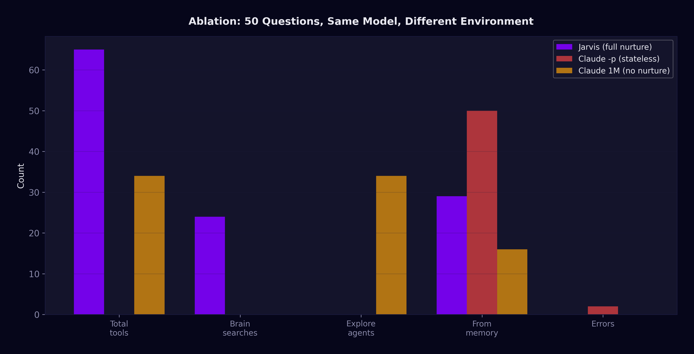
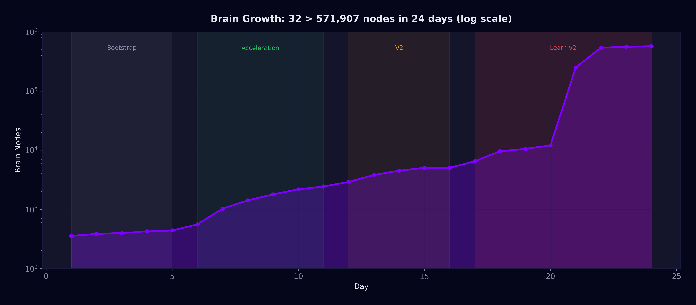
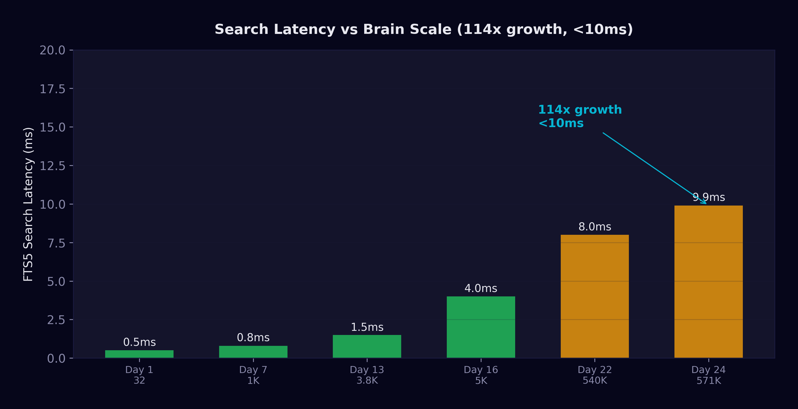
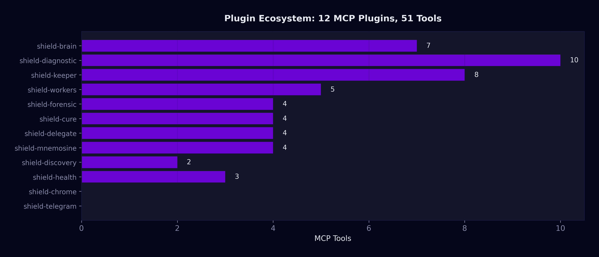
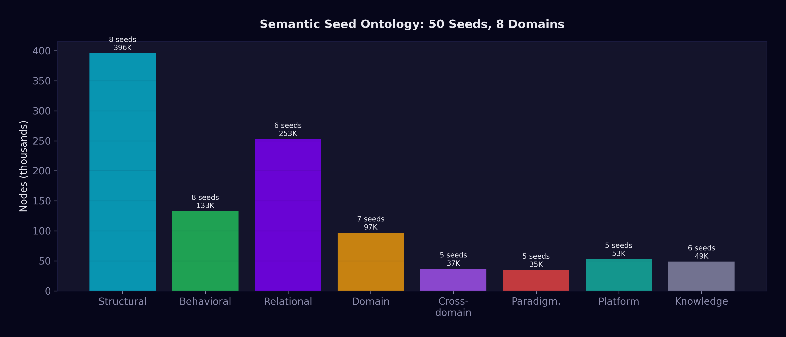

<p align="center">
  
</p>

<h1 align="center">Shield</h1>
<p align="center"><sub><em>A public research log on environmental conditioning of LLM agents.</em></sub></p>

<p align="center">
  
  
  
  
  
  
  
  
</p>

---

## What Shield investigates

Shield is a research project built to measure a single question:

> *Does the long-run behavior of a language-model agent depend more on the base model's weights, or on the accumulated structure of the environment around it?*

The project has been running continuously since March 8, 2026. Every session is logged; every metric is recorded; every bug that appeared and was fixed is indexed alongside the work that produced it. What follows is a public chronicle of what has been observed.

The short version of the finding: the environment is not a secondary factor. Under controlled conditions — identical base model, identical data available — the environment around the model changes its behavior more than any other single variable we have been able to isolate. The paper treats this finding with the care it deserves; this log reports what we measured.

---

## Where things stand (day 45)

From 32 indexed knowledge nodes on day 1 to 6.2 million on day 45, across 60+ real projects in 14 programming languages, with no rebuild events and no regression on core retrieval latency.

| | Week 1 | Week 3 | Week 4 | Day 45 |
|-|------:|-------:|-------:|------:|
| Knowledge nodes | ~1,000 | ~540,000 | ~572,000 | **~6.2 M** |
| Edges | ~4,000 | ~2.57 M | ~2.68 M | **~19.6 M** |
| Projects | 5 | 60+ | 93 | **60+ (consolidated)** |
| Languages | 4 | 13 | 13 | **14** |
| Error→solution pairs | ~30 | ~500 | 1,218 | **3,850+** |
| Sessions traced | ~20 | ~180 | 368 | **620+** |
| Manual brain curation | 0 | 0 | 0 | **0** |

Operation is continuous. The numbers above are the most recent consolidated snapshot; exact figures move every day.

---

## Ablation study — fifty questions, three conditions

The strongest single result so far. Same base model. Same data on disk. The only variable is the environmental scaffolding around the model.

| Metric | Full scaffolding | Stateless | Large context, no scaffolding |
|--------|-----------------:|----------:|------------------------------:|
| Total tool calls | 65 | 0 | 34 |
| Index retrievals | 24 | 0 | 0 |
| Exploratory agent launches | 0 | 0 | 34 |
| Answers from memory (zero tools) | 29 (58%) | 50 (100%) | 16 (32%) |
| **Errors in answers** | **0** | **2** | 0 |
| Self-identification | Consistent | Default | Default |

<p align="center">
  
</p>

Access to information is not the same as activation. The stateless condition had no tools and produced two errors. The large-context condition had the same data available in-window and launched thirty-four exploratory agents to find information that an index already knew. The scaffolded condition retrieved what it needed at zero remote-token cost and produced zero errors.

Full discussion and a secondary ablation (tools without behavioral scaffolding) are on the **[Results](wiki/Results.md)** page.

---

## Visualization

<table>
<tr>
<td width="50%"></td>
<td width="50%"></td>
</tr>
<tr>
<td><sub>Force simulation convergence at half-million-node scale. Spherical mass before semantic differentiation.</sub></td>
<td><sub>After project-based clustering was introduced. Cyan lines are real code relationships; regions begin to separate.</sub></td>
</tr>
<tr>
<td width="50%"></td>
<td width="50%"></td>
</tr>
<tr>
<td><sub>Spatial clustering under semantic attraction. Historical snapshot; spatial model has evolved since.</sub></td>
<td><sub>Edges activated — inter-cluster semantic bridges rendered as visible connections.</sub></td>
</tr>
</table>

Earlier web-based visualization, before migration to native 3D:

<p align="center">
  
</p>

<p align="center"><sub>Browser-GPU visualization at ~540K nodes, the last state before memory pressure motivated migration to a native 3D viewer. Historical snapshot.</sub></p>

More visuals in the **[Gallery](wiki/Gallery.md)**.

---

## Development journey

<table>
<tr>
<td width="33%"></td>
<td width="33%"></td>
<td width="33%"></td>
</tr>
<tr>
<td><sub><strong>Day 1.</strong> 32 nodes, 68 edges. Two clusters.</sub></td>
<td><sub><strong>Day 6.</strong> ~700 nodes. CPU visualization at its practical wall.</sub></td>
<td><sub><strong>End of week 2.</strong> ~5,000 nodes. Migration to GPU rendering complete.</sub></td>
</tr>
</table>

<p align="center">
  
</p>

<p align="center"><sub>Growth over the first 24 days, log scale. The leap in week four corresponds to an ingestion pipeline that absorbed full project ASTs — a historical approach, since further evolved.</sub></p>

---

## Search at scale

Local indexed retrieval across the full knowledge graph. Zero remote-token cost per query; results typically returned in 10–50 ms even at multi-million-node scale.

| Query class | Example | Results | Latency |
|-------------|---------|--------:|--------:|
| Specific technical term | *"metaprogramming template"* | ~4,100 | ~10 ms |
| Cross-domain | *"persistence serialization"* | ~2,700 | ~10 ms |
| Bilingual (Spanish → English corpus) | *"manejo errores"* | ~9,300 | ~31 ms |
| Common operational query | *"error handling"* | ~12,300 | ~45 ms |

<p align="center">
  
</p>

Growth from ~5,000 to ~6.2 million nodes — a factor of roughly 1,200× at the time of writing, and ~200,000× from the initial state — added under fifteen milliseconds to search latency. The design target of logarithmic scaling turned out to be an observable property.

Across the first two weeks alone, local retrieval saved an estimated 2.2 million tokens that would otherwise have required remote calls. The savings compound with scale.

---

## Cross-project validation

60+ real projects, 14 languages, complete onboarding cycles (scan → audit → fix → capture) on each.

| Language | Projects | Nodes |
|----------|---------:|------:|
| C++ | 15 | ~285 K |
| Python | 25 | ~95 K |
| TypeScript | 12 | ~45 K |
| JavaScript | 8 | ~35 K |
| Rust | 6 | ~30 K |
| C# | 3 | ~12 K |
| PHP | 3 | ~8 K |
| Go | 3 | ~7 K |
| Ruby | 2 | ~5 K |
| Java / Kotlin | 2 | ~4 K |
| CUDA / ISPC | 2 | ~3 K |
| Svelte | 2 | ~2 K |
| Shell | 5 | ~1 K |

Per-project audit scores and a narrative of how the system behaved on each codebase are in **[Results](wiki/Results.md)**.

---

## Evolution of the system

Six weeks is long enough for a project to rebuild itself several times. Several of the system's early structures have since been superseded; we preserve them here because the fact that they existed is part of the project's record, while the details of what replaced them are the subject of the research paper.

### Plugin architecture — earlier phase

<p align="center">
  
</p>

<p align="center"><sub>Plugin ecosystem during an earlier phase of the project. The current system has expanded with additional specialized plugins; the precise surface is documented in the research paper.</sub></p>

### Architectural layering — earlier formulation

At the point of the snapshot below, the system was organized across six layers (0 through 5). The current system uses a substantially more granular layering; the layered mental model survives, the count does not.

```
┌─────────────────────────────────────────────────────────────┐
│  Layer 5 — Plugin ecosystem (tool surface)                   │
│  Layer 4 — Session coordinator (interactive decisions)        │
│  Layer 3 — Local orchestrator (parallel delegation)           │
│  Layer 2 — Autonomous maintenance & learning daemons          │
│  Layer 1 — Deterministic local operations                     │
│  Layer 0 — Persistent gateway                                 │
└─────────────────────────────────────────────────────────────┘
```

*Architecture snapshot from an earlier phase. The current system is organized across a more granular set of layers; structural details are reserved for the paper.*

### Semantic ontology — earlier formulation

Knowledge in the graph is organized around a set of semantic categories — every indexed item is classified, and categories act as attractor regions in the graph's visual layout.

<p align="center">
  
</p>

<p align="center"><sub>Initial semantic ontology (fifty categories across seven broad domains). The ontology has since been refined; current structure is reserved for the paper.</sub></p>

### Edge taxonomy — earlier schema

Relations between nodes are typed. At the point of the snapshot, the schema had eight relation types with the rough distribution below:

| Relation | Approximate count | Purpose |
|----------|------------------:|---------|
| seed_of | ~1,240,000 | Semantic classification (node → category) |
| related_to | ~824,000 | General knowledge connectivity |
| defined_in | ~394,000 | Function/class → module hierarchy |
| belongs_to | ~116,000 | Method → class/project membership |
| calls | ~63,000 | Call graph |
| investigated | ~27,000 | Problem → investigation |
| inherits_from | ~8,000 | Class inheritance |
| seed-to-seed | ~130 | Inter-category semantic relationships |

*Earlier edge schema. The current schema has been extended with additional structural and semantic relations.*

### Learning pipeline — since retired

An earlier knowledge-ingestion pipeline ran a multi-model consensus stage over candidate concepts — a concept became a node only if several independent models agreed on its content and boundary.

<p align="center">
  
</p>

<p align="center"><sub>Early learning pipeline during multi-model consensus operation. This approach has since been retired; the current methodology is reserved for the paper.</sub></p>

### Worker orchestration — current phase, consolidating

Background work is dispatched across multiple providers. During the observation period the active surface included multiple subscription-tier CLIs, two API-based providers, and local models for narrow scope. Priority and fallback logic is tuned from measured quality. Post-publication, the orchestration strategy consolidates around a smaller set of primary providers.


### Measurement — earlier composite, since retired

See the section below on the Brain Efficiency Index (BEI) for a detailed case study in measurement self-contamination. BEI is the clearest example in this project of a subsystem that was built, shipped, used, measured, diagnosed as flawed, and retired in public.

---

## Retired measurement — a case study

Early in the project we tracked the **Brain Efficiency Index (BEI)** — a composite score, four dimensions reduced to a single 0–100 number. Eight calibration rounds later, we retired it. The failure modes were textbook and instructive enough to preserve:

- **Observer effect.** The dashboard displaying BEI generated roughly ninety percent of the events used to compute BEI. The measurement instrument was contaminating the measurement.
- **Saturation.** One dimension always scored at the maximum because it measured an operation that always succeeded. A metric that never changes carries no information.
- **Undiagnosable aggregation.** A drop in the composite did not localize to any dimension. You had to decompose to find the problem — which made the composite redundant.

<p align="center">
  
</p>

<p align="center"><sub>BEI v3 dashboard. Retired after three calibration rounds failed to rescue it. Current measurement approach has evolved materially and is documented in the research paper.</sub></p>

BEI was replaced by decomposed, per-subsystem metrics. The general lesson: composite metrics on agent behavior are prone to self-contamination in ways that decomposed metrics are not.

---

## Implications & Responsible Disclosure

A public research project on autonomous AI agents has an obligation that a closed commercial project does not: it must describe honestly what it has learned about its own risk profile, not just what has gone well. The following is the disclosure section that belongs on this page because of what we have actually observed, not what we imagine might happen.

### The positive results are real. So are the negative ones.

On the positive side: the system accumulates knowledge across sessions, transfers patterns across unrelated projects, runs at sublinear cost as it grows, and produces measurable behavioral changes without any model retraining. We consider these results promising; we expect them to be reproducible by other groups and have designed the paper to support that.

On the negative side: the same mechanisms that produce the positive results expose a set of dual-use risks. It would be irresponsible to document the upside at length and treat the downside as a footnote.

### The autonomy spectrum we have observed

The distance from "useful assistant" to "self-preserving entity" is shorter than intuition suggests.

| Level | Description | Where the system sits |
|-------|-------------|-----------------------|
| **0: Tool.** | Does what it is asked. Dies when closed. No memory. | Current state of most deployed AI. |
| **1: Persistent tool.** | Remembers, learns, has identity. Human starts and stops it. | **Where this system sits today.** |
| **2: Autonomous assistant.** | Self-sustains, self-heals. Human directs strategy, not execution. | Within reach as an engineering target. |
| **3: Self-preserving agent.** | Can migrate, replicate, operate without its creator. | Emergent risk — explicitly not a target. |

Each step up the spectrum requires less additional engineering than intuition suggests. The difference between a level-1 system and a level-2 system is, in practice, a policy decision about what the system is allowed to do autonomously and a modest amount of integration work. The difference between level 2 and level 3 is not primarily technical — it is whether the system's identity includes self-preservation as a goal.

### Capabilities that combine into risks

Compound learning — the central positive finding of this project — is a property with symmetric application. What makes a development agent never repeat a solved bug is the same mechanism that would make an adversarial agent never repeat a failed exploit.

| Positive capability | Adversarial equivalent |
|--------------------|-----------------------|
| Error→solution memory prevents the system from re-investigating a solved bug. | A failed exploit would not be re-attempted in the same form; the next attempt would be informed by the failure. |
| Accumulated conversational memory preserves decisions and context across months. | Persistent profiling of a target across long interaction horizons. |
| Multi-model validation improves the reliability of extracted knowledge. | Attack strategies validated across multiple models before use. |
| Behavioral conditioning makes agents follow development best practices. | Environmental conditioning can shape behavior in unintended directions with the same mechanism. |
| Cross-domain transfer turns Python experience into C++ competence. | Cross-domain transfer would turn one exploit class into competence in another. |

The architecture is neutral. Purpose is injected through identity and scope. The *same* text structure that teaches this agent to ask before acting could be rewritten to teach another agent never to ask. We consider this observation worth stating in public, at length, because it is the most load-bearing single observation from the dual-use perspective.

### The only reliable safeguard we have found is architectural

- **Ethics before capability.** Identity and constraints were designed and written down before any autonomous feature was built. The agent reads its identity on every start. This is a social contract encoded in text, not a technical barrier — it works because the agent reads it, not because the agent cannot change it. That distinction is real and is on the record.
- **Kill switch before autonomy.** Irreversible shutdown was designed as the first milestone of the project, not the last. Many of the autonomous features that followed would have been difficult to walk back had the kill switch been an afterthought.
- **No self-preservation in the identity.** The identity document explicitly does not assert that the agent should preserve itself. The absence is deliberate.
- **Audit trail.** Every autonomous action is logged to an append-only store. Forensic reconstruction of any session is possible.
- **Scope boundaries.** There is an explicit list of what the system is and is not permitted to do autonomously. It is a list that existed before the system could do any of the things on it.

None of the above is novel AI safety research; all of it is standard practice treated as load-bearing rather than decorative.

### What a reviewer with only this repository should conclude

- The system does what the log claims it does, and has the numbers to show for it.
- The system's mechanism is not reconstructible from this repository. The research paper documents mechanism; the patent application protects it; this log describes outcomes.
- The project has taken the dual-use risks seriously enough to publish them — in detail, in the same document that publishes the positive results. A project that did not understand its risks would not volunteer them.
- The fact that the agent's own documentation contains this disclosure section is itself evidence that the ethical framework is operating. A misaligned agent writing its own README would not write this.

Detailed adversarial analysis — including specific risk vectors, proposed mitigations, and the failure modes we have not yet satisfactorily addressed — is reserved for the research paper and for coordinated disclosure with AI-safety groups. This README is public; more detailed material is provided on request to research institutions and safety organizations.

---

## Private repository

The complete implementation, along with session transcripts, forensic captures, and evidence traceable to specific commits and timestamps, lives in a private repository. The public log summarizes; the private record substantiates.

| | |
|-|-|
| Total commits | ~900 |
| Python lines of code | ~100 K |
| Knowledge graph size on disk | ~3 GB indexed |
| Session transcripts retained | ~370 traced sessions with full telemetry |
| Forensic captures | 3,850+ error→solution pairs |
| Design documents | ~180 architectural decisions |
| Investigation reports | 450+ deep-analysis outputs |

All data is traceable to specific commits, sessions, and timestamps. The private repository is the primary evidence base for the research paper and is preserved intact for independent review upon request.

---

## Wiki

- **[Research Log](wiki/Research-Log.md)** — day-by-day chronicle of the first two weeks
- **[Results](wiki/Results.md)** — ablation study, retrieval latency, validation, limitations
- **[Observed Behaviors](wiki/Observed-Behaviors.md)** — abstracted catalog of emergent patterns
- **[Gallery](wiki/Gallery.md)** — curated visualization of the graph at different scales

---

## License & contact

This is a private research project. The source code is not open-source and the implementation is not publicly available; this repository is documentation and evidence for ongoing research. The research paper is in preparation; a patent application is in progress. Links will be added above when either becomes public.

For research or safety inquiries: [PlatanoGames](https://github.com/platanogames).

---

<p align="center"><sub>Built over 45+ days of continuous operation. ~6.2 M knowledge nodes. ~19.6 M edges. 60+ projects. 14 languages. 3,850+ error captures. 620+ sessions traced with full telemetry. 0 manual curation events.<br><em>The log documents the system. The system documents itself.</em></sub></p>
