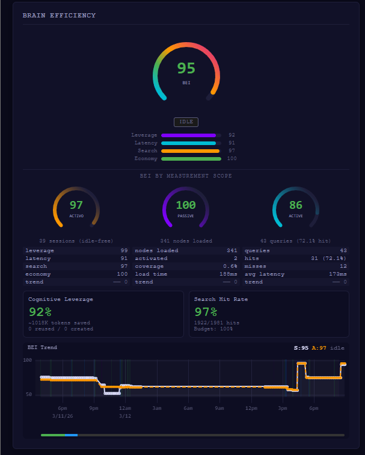

# From BEI to Efficiency Trends: Shield's Measurement Evolution

Shield's core claim is that a persistent knowledge brain improves an LLM agent's
performance over time. Without measurement, that claim is unfalsifiable. This page
documents how Shield tried to measure its own intelligence, discovered that its
measurement system was contaminating itself, rebuilt the system three times, and
ultimately concluded that a composite score was the wrong abstraction entirely.

The full arc — BEI v1 (2026-03-09) through composite deprecation (2026-03-16) —
took exactly one week.

---

## Table of Contents

1. [The Question BEI Was Trying to Answer](#the-question-bei-was-trying-to-answer)
2. [BEI v1: The Original Composite](#bei-v1-the-original-composite-2026-03-09)
3. [Calibration Round 8.1: Idle Time Contamination](#calibration-round-81-idle-time-contamination)
4. [Calibration Round 8.2: The Observer Effect](#calibration-round-82-the-observer-effect)
5. [Calibration Rounds 8.3–8.6: Evidence and Scale](#calibration-rounds-83-86-evidence-and-scale)
6. [Calibration Round 8.7: BEI v2](#calibration-round-87-bei-v2-2026-03-12)
7. [BEI v3: The Virus Enables Measurement](#bei-v3-the-virus-enables-measurement-2026-03-15)
8. [BEI Deprecation: The Score Fallacy](#bei-deprecation-the-score-fallacy)
9. [The Replacement: Six Efficiency Trends](#the-replacement-six-efficiency-trends-2026-03-16)
10. [The Calibration Attribution Framework](#the-calibration-attribution-framework)
11. [Summary Timeline](#summary-timeline)
12. [What Was Kept and What Was Retired](#what-was-kept-and-what-was-retired)

---

## The Question BEI Was Trying to Answer

A persistent brain that accumulates knowledge across sessions could, in principle, make
an LLM agent faster, cheaper, and less error-prone. But it could equally accumulate
garbage and make it worse. Without measurement, there is no way to tell.

**BEI (Brain Efficiency Index)** was created to answer one question:

> "Is the brain helping or hurting?"

Without BEI, Shield could accumulate 500 low-quality nodes and nobody would know
until Jarvis started hallucinating. BEI was the feedback signal intended to close
the loop: learn → grow → measure → correct.

The problem is that BEI answered this question incorrectly in three different ways
before being retired entirely.

---

## BEI v1: The Original Composite (2026-03-09)

### Architecture

BEI v1 was a weighted composite of four dimensions, each scored 0–100:

```
BEI = 0.25·L + 0.25·S + 0.25·H + 0.25·R  ∈  [0, 100]
```

**L — Cognitive Leverage**: Ratio of knowledge reuse to new knowledge creation.

```python
A = count(activate_node events)
C = count(add_edge events)
M = count(ramify events)
L = min(100, (A / (A + C + M)) * 200)   # 50% reuse → score 100
```

The `× 2` multiplier reflected a deliberate design choice: a system that reuses half
and creates half was deemed to be in a healthy steady state.

**S — Latency Stability**: Trend in brain loading speed, log2-normalized to account
for expected O(n log n) growth.

```python
change = (avg_second_half_normalized - avg_first_half_normalized) / avg_first_half
S = clamp(50 - change * 100, 0, 100)
```

A perfectly stable brain could never exceed 50 on this metric. This proved to be a
critical flaw.

**H — Search Hit Rate**: Direct measurement of query success.

```python
H = (hits / total_searches) * 100
```

This was the only dimension that was correct from the start.

**R — Knowledge ROI**: Trend in tokens-per-operation across session segments.

```python
change = (avg_2nd_half_tokens_per_op - avg_1st_half_tokens_per_op) / avg_1st_half
R = clamp(50 - change * 50, 0, 100)
```

Another trend-based metric. Another permanent ceiling of 50 for stable systems.

Three of four dimensions measured *whether things were improving*, not *whether they
were good*. A mature brain performing optimally from day one would score ≈ 50
permanently on L, S, and R.

### BEI Passive / Active Split

An orthogonal measurement tracked access pattern rather than efficiency:

```python
# Passive: sqrt scaling (diminishing returns on loaded node count)
BEI_passive = min(100, sqrt(passive_nodes) * 6)   # 280+ nodes → 100

# Active: linear in queries, boosted by hit rate
BEI_active = min(100, num_active_queries * 5 + active_hit_rate / 2)
```

The passive metric saturated at 100 immediately and remained there, becoming
completely uninformative. This was noted but not fixed in v1.

---

## Calibration Round 8.1: Idle Time Contamination

The first contamination source discovered was structurally obvious in retrospect:
**the human was being measured**.

**Symptom**: BEI dropped during coffee breaks and idle periods, even though the brain
had not degraded.

**Root cause**: All four BEI dimensions use time-windowed events. When the operator
paused, the window filled with zero-activity intervals, diluting rolling averages.
The Latency and ROI trend calculations interpreted silence as degradation.

**Fix**: Introduced `BEI_activo` — the same formula applied only to events within
active session windows, where a 120-second inactivity gap marks a new session boundary.

```python
def bei_activo(self) -> dict:
    sessions = self._segment_sessions()  # 120s gap = new session
    windows = [(sess[0].ts_ms, sess[-1].ts_ms) for sess in sessions]
    active_events = [
        e for e in self.events
        if any(start <= e.ts_ms <= end for start, end in windows)
    ]
    sub = SessionEfficiencyAnalyzer(active_events)
    return sub.brain_efficiency_index()
```

The BEI Session / BEI Activo gap became a proxy for human idle fraction within a
session. Both variants were persisted in the efficiency history log (last 500 entries,
5-minute dedup window).

**Methodological implication**: Any system claiming performance metrics must document
whether human idle time is included in the denominator. Without explicit separation,
the metric measures operator work habits as much as system behavior.

---

## Calibration Round 8.2: The Observer Effect

This was the most significant contamination source: **the dashboard designed to display
BEI was generating 90% of the events that computed BEI**.

**Symptom**: BEI latency score = 0 (expected ≈ 55–70). BEI composite = 64 instead of
the expected ≈ 77. Leverage and ROI scores were healthy (68 and 87), but the composite
was pulled down by an invisible force.

**Diagnostic evidence from the event log**:

| Category | Event count | Share |
|----------|-------------|-------|
| Dashboard polling (`graph_load` every 5 s) | 2,208 | 90.1% |
| Genuine agent operations | 101 | 4.1% |
| Other system events | 143 | 5.8% |
| **Total** | 2,452 | 100% |

The ms/node distribution was bimodal: a fast regime at 0.35–0.45 ms/node, and a slow
regime at 2.0–2.6 ms/node. Critically, **the same brain size (173 nodes) produced
both values** — proving the slow regime was I/O contention from concurrent worker
processes, not brain degradation.

The causal chain:

```
Workers running → disk I/O contention
→ dashboard reloads graph every 5s during contention
→ graph_load takes 5× longer
→ profiler computes "degradation" = +117% change
→ latency_stability() returns score = 0
→ BEI drops 13+ points
```

**Fix** (`neural/profiler.py`, `latency_stability()`): Two-stage filtering.

1. **Window dedup (60 s)**: Dashboard generates ≈ 12 samples/minute. Keep only the
   fastest (minimum ms/node) per 60-second window. Reduces 2,452 → 259 samples.

2. **I/O contention filter**: Remove any sample above 3× the median ms/node across
   deduped samples. Eliminates the slow regime caused by worker disk contention while
   preserving true brain loading performance. 259 → 139 samples.

**Before vs after**:

| Metric | Contaminated | Filtered |
|--------|-------------|----------|
| Latency score | 0 | 55 |
| BEI composite | 64 | 77.3 |
| Data points used | 2,452 (90% noise) | 139 (clean) |
| ms/node trend | +117% (false degradation) | −4.5% (slight improvement) |

**Architectural lesson**: Separate observation channels from operational channels.
The dashboard should tag its `graph_load` events with `source: dashboard` for
downstream filtering. The statistical fix works, but source tagging is the cleaner
architectural solution. This pattern — the measurement tool contaminating the
measurement — is analogous to Heisenberg's observer effect at the software system
level.

---

## Calibration Rounds 8.3–8.6: Evidence and Scale

### 8.3 — Token Efficiency Evidence

Measurement across all sessions on 2026-03-10:

```
Brain operations:     5,638 events — ALL zero LLM tokens (pure Python)
  ├── 2,756 searches           (replace grep→read→reason cycles)
  ├── 2,551 graph loads        (replace structural understanding)
  ├──    33 brain queries      (replace multi-file exploration)
  └──    11 node activations   (replace file reads)

LLM token distribution:
  ├── Output (writing):    727K tokens  (0.3%)  ← the only real cognitive cost
  ├── Input (fresh):        87K tokens  (0.0%)
  └── Context (cache):    260M tokens  (99.7%) ← reused, not regenerated
```

Each brain search replaced an estimated grep→read→reason cycle of ≈ 800 tokens.
With 2,756 searches: estimated savings ≈ 2.2M tokens against 727K output tokens
actually spent. The brain saved roughly 3× what was consumed in that measurement window.

**Caveat documented at the time**: This is observational evidence. A controlled A/B
comparison (same tasks, agent with brain vs agent without brain, token counts compared)
is required for rigorous attribution. The denominator excludes worker tokens, which
are counted separately (see §BEI Deprecation for why this matters).

### 8.4 — The Inverted Cost Pyramid

Shield inverts the normal LLM cost structure:

```
Layer                 Cost             Without Shield
─────────────────────────────────────────────────────────────
Brain (Python)        $0               Doesn't exist → LLM searches everything
Workers (flat-rate    ~$0              LLM does audit → 3–5× more output tokens
  subscriptions)      (flat sub)
Cache (260M tokens)   ~90% off         Fresh context every turn
Primary LLM           727K output      Would be ~3M+ without brain or workers
  (judgment only)
```

The architecture exploits the asymmetry between exploration (expensive, parallelizable)
and judgment (cheap, sequential). Flat-rate subscription workers handle parallelizable
audit and analysis work; the primary LLM handles only decisions that require judgment.

### 8.5 — Scale Inflection Prediction

Five documented risks that could degrade brain quality at scale:

| Risk | Mechanism | Predicted threshold |
|------|-----------|---------------------|
| Keyword saturation | Common terms activate too many nodes | > 8% node hit rate on generic terms |
| Context pressure | Too many activated nodes → budget overflow | > 20K chars activated per query |
| Cross-domain collision | Unrelated projects share keywords | > 5 false-positive cross-edges per query |
| Keeper O(N²) | Pairwise comparison in consolidation | > 1,000 nodes → > 10-min keeper cycles |
| Graph density | Too many edges → slow traversal | > 3,000 edges |

The falsifiable prediction: at ≈ 900 nodes, either the output ratio stays ≤ 1%
(validated) or crosses 2% (inflection found, document the mechanism).

### 8.6 — Scale Framing

A typical developer maintains 7–10 active projects. Shield had already validated 7
projects at BEI peak 99, sustained 82–83 for 75+ minutes, at 0.3% output ratio.
The 900-node run is not the target — it is the honest stress test to find limits.

---

## Calibration Round 8.7: BEI v2 (2026-03-12)

### The E-053 Test That Broke v1

E-053 was a cold-start contamination resistance test: the agent started with no
workers, navigating a brain of 295 nodes, 1,100 edges, 14 domains, 18 library
repositories, across 6 escalating phases.

Results:

- 3.7% of brain accessed (11/307 paths)
- 0% cross-domain contamination across 26 knowledge sources
- 98% search hit rate
- 100% of factual claims traced to brain sources
- 6 contamination types verified absent

Under BEI v1, this session scored **Leverage: 47/100**. The formula interpreted
"used only 3.7% of brain" as poor performance. The test proved it was optimal.

### The Diagnosis: Trend Metrics Penalize Success

All three flawed dimensions shared the same structural problem: measuring trend
(are you improving?) instead of state (are you good?).

| Metric | v1 formula | Score for perfectly stable brain | Root cause |
|--------|-----------|----------------------------------|------------|
| Leverage | read / (read + write) | Penalizes selectivity | Compares retrieval to creation |
| Latency | half-to-half trend | 50 (permanent ceiling) | No reference point |
| ROI | half-to-half token trend | 50 (permanent ceiling) | Same disease |

A mature, optimized brain that works correctly from day one would score ≈ 50/100 on
all three trend-based metrics permanently. The formulas penalized success and rewarded
degradation-followed-by-recovery.

### Three-Round Design Review

**Round 1**: Identified Leverage and Latency as conceptually flawed. Proposed replacing
Leverage with hit rate (precision over coverage), and Latency with an absolute overhead
ratio.

**Round 2** (critical catch): The proposed Latency replacement used
`brain_ms / (brain_ms + inference_ms)`. This was identified as duplicating the Speed
axis — both measures would have been speed metrics. If implemented, BEI would have
had two Speed metrics and no Economy metric. The four dimensions must be orthogonal.

**Round 3**: Evaluated five options for the ROI dimension:

| Option | Description | Selected? |
|--------|-------------|-----------|
| 1. Eliminate ROI (3 metrics) | Drop the dimension entirely | No — loses economy signal |
| 2. Yield (productive/total ops) | Activity measure | No — wrong axis |
| 3. True Token ROI (cost tables) | Estimated tokens saved vs invested | **Yes** |
| 4. Token ROI + model multiplier | Weighted by model cost | Future |
| 5. Option 4 + negative ROI | Penalty for bad information | Future |

### BEI v2 Formulas

**Leverage v2 — Activation Precision**

```python
leverage_score = search_pragmatism()['hit_rate']
# Old: min(100, (activated / (activated + edges + ramify)) * 200)
```

**Latency v2 — Brain Overhead vs Inference**

```python
CONSERVATIVE_INFERENCE_MS = 3000  # minimum realistic non-cached LLM response
overhead_pct = avg_load_ms / (avg_load_ms + CONSERVATIVE_INFERENCE_MS) * 100
latency_score = max(0, min(100, round(100 - overhead_pct * 2)))
# Example: 229ms brain load → overhead = 7.1% → score = 86
```

**Search v2 — Hit Rate (unchanged)**

```python
hit_score = search_pragmatism()['hit_rate']
```

**ROI v2 — True Token Economy**

```python
INVESTMENT_COST = {
    'ramify': 1500, 'add_edge': 800, 'ck_build': 3000, 'index_rebuild': 0
}
SAVINGS_VALUE = {
    'search_hit': 1200, 'activate_node': 300,
    'activate_context': None  # uses budget // 4
}
# score = min(100, round(roi_ratio * 25))   — 4:1 ratio = score 100
```

### Measured Results with Real Data (9,338 events)

```
v1 Leverage:   46.0  →  v2 Leverage:   98.2   (+52.1)
v1 Latency:      44  →  v2 Latency:      94   (+50)
v1 Search:     98.2  →  v2 Search:     98.2   (unchanged)
v1 ROI:          50  →  v2 ROI:         100   (+50)
────────────────────────────────────────────────────
v1 BEI:        59.5  →  v2 BEI:        97.6   (+38.1)
```

ROI breakdown: investment = 136,800 tokens (27 ck_build × 3,000 + 51 add_edge × 800
+ 10 ramify × 1,500); return = 5,451,615 tokens (4,528 search hits × 1,200 + other);
ratio = 39.9:1 → score = 100 (capped).

**Interpretation**: The +38.1 jump does not mean the brain improved between March 10
and March 12. The brain was already performing at this level. The old formulas were
misrepresenting it.

### The Forge Query Exclusion Bug

Immediately after the v2 redesign was approved, a third self-contamination bug was
found in the legacy Leverage formula.

**Problem**: `cognitive_leverage()` counted only `activate_node` events as brain
reuse (2 events in the log). It completely ignored `search`, `brain_query`, and
`find_related` operations (2,032 events) — the primary mechanism through which
instrumented tools query the brain.

**Root cause**: A legacy branch used `efficiency_audit` snapshot events that
pre-dated the current query tooling. Those snapshots stored `activated_nodes`,
`new_edges`, `ramifications` — counters from before `brain_tools.py` existed.

**Before and after fix**:

```
BEFORE:  reuse_ops = 143     (activate_node + audit snapshot)
         creation_ops = 942
         leverage = 13.2%,  BEI = 75.3

AFTER:   reuse_ops = 2,036   (search + brain_query + find_related + activate_*)
         creation_ops = 158
         leverage = 92.8%,  BEI = 95.2  (+19.9)
```

**Pattern confirmed**: Three self-contamination bugs across three rounds (8.1, 8.2,
8.7), all sharing the same structure — the observation system contaminates the metric
it observes. Each fix reveals the next layer.

---

## BEI v3: The Virus Enables Measurement (2026-03-15)



### The False Premise in BEI v2

By March 15, BEI v2 was showing a gradual downward trend:

```
Date             BEI    Active   Hit%    Sessions
Mar 13 14:24    95.0    86.4    72.7%      47
Mar 14 15:38    94.5    84.7    69.4%     110
Mar 15 00:03    93.1    82.2    64.3%     158
Mar 15 18:05    90.6    81.7    63.4%     193
```

4.4 points down in 52 hours. The brain had not degraded — 699 new library nodes
(61% of the total brain) had been added as reference material that would rarely be
queried in any single session. More sessions meant more diverse queries, but the
brain remained concentrated in the same 144 actively used nodes.

The coverage metric (`passive_coverage_pct: 11.6%`) was flagged as a health warning.
But in a selective activation system designed so that Unreal Engine knowledge never
activates during web work, 11.6% coverage is not failure — it is correct operation.
The metric was penalizing the brain for doing exactly what it was designed to do.

### Behavioral Routing: Before and After

The introduction of a behavioral modification system (virus-parasite injection) that
routes all agent navigation through instrumented tools produced a dramatic change in
measurement coverage:

| Period | Context | Brain queries/hour | Pattern |
|--------|---------|-------------------|---------|
| Mar 11–12 | Without behavioral routing | 2.0/h | Sporadic, reactive |
| Mar 13 | Learner pipeline (automated) | 9.3/h | Machine-generated |
| Mar 14 | API REPL (controlled session) | 7.2/h | Directive-driven |
| **Mar 15 17:42+** | **With behavioral routing** | **~36/h** | **Organic, continuous** |

The 18× increase in brain routing rate means every brain query now generates a
timestamped event with query, hits, duration, and estimated tokens. Before routing,
the agent navigated through native filesystem tools (grep, glob, read) — unmeasured.
After routing, all navigation routes through instrumented brain tools — measured.

**The behavioral change does not just change the agent's behavior — it enables
measurement of that behavior for the first time.**

### Token Savings (Directly Measured)

For a specific documentation question:

- With brain routing: 1,550 tokens (4 brain queries + 3 targeted file reads) → full answer
- Without brain routing: ~10,400 tokens (ls + glob + grep + read 3 full files) → same answer
- **Per-query savings: 85%**

Full session estimate: ~15,200 tokens via brain vs ~60,000+ tokens for equivalent
information. **Session savings: ~75%**.

### BEI v3 Design

BEI v3 replaced the four dimensions with two genuinely new measurements:

**Dimension 1 — Navigation Efficiency (NE)**: How cheaply did the agent reach its answer?

```
NE = tokens_saved / (tokens_saved + tokens_spent_navigating)
```

- `tokens_saved`: brain queries with hits × estimated replacement cost (1,200 tokens/hit)
- `tokens_spent_navigating`: brain query output tokens + subsequent file reads

Target: NE > 0.75 means brain saves 3× what it costs to query.

**Dimension 2 — Learning Curve**: Does the agent make fewer mistakes over time?

Each investigation stores `problem → attempted_solution → outcome`. Over time:
- `error_recurrence_rate` should rise (more errors pre-solved)
- `resolution_speed` should drop (fewer hops per fix)
- `investigation_avoidance` should rise (lookup resolves without new investigation)

---

## BEI Deprecation: The Score Fallacy

Even as BEI v3 was being designed, a more fundamental critique of the composite
approach emerged.

### Three Structural Flaws

**Flaw 1 — Punishing Selective Activation**: Shield's brain is a selective activation
system. With 1,184 nodes across 7 projects and 5 languages, a single session working
on one project will only ever activate a small fraction. BEI treated low activation
percentage as poor performance:

```
Coverage:  activated / total_nodes          ← what BEI measured (wrong)
Precision: correct_activations / total_activations  ← what matters (right)
```

Precision penalizes noise (activating irrelevant nodes). Coverage penalizes silence
(not activating useless nodes). They are opposite metrics.

**Flaw 2 — The Token Savings Illusion**: BEI reported "~2.2M tokens saved" as a
headline metric. This is technically accurate but incomplete. Worker processes
(audit, analysis, parallel review) spend millions of tokens — not counted. Saying
"the primary LLM saved 2.2M tokens" without counting worker tokens is analogous to
reporting reduced headquarters cost while tripling outsourcing spend. The system does
not use fewer tokens in total — it redistributes from expensive primary inference to
lower-cost workers. The honest metric is cost-per-correct-decision, including all
tokens across all processes.

**Flaw 3 — The Score Fallacy**: A gauge showing "90" or "95" satisfies the human need
for ranking but provides no actionable signal. BEI Active saturated at 97–100; a
metric that is always perfect is useless. A score of 95 does not indicate whether the
brain is learning, repeating errors, using available tools, or activating the right
nodes.

### The Investment vs Return Distinction

BEI mixed two fundamentally different token phases:

**Investment phase** (obligatory cost): Library ingestion, keeper maintenance, link
repair, worker launches for diagnosis. Tokens here are capital — they buy future
retrieval capacity. Measuring them as ongoing cost misframes them.

**Return phase** (where investment pays off): Operational queries, decision-making,
error avoidance, tool selection. The falsifiable prediction: in the return phase, each
session should cost less than the previous one for equivalent task types. A falling
curve proves the brain is learning. A flat curve means it stores but does not transfer.
A rising curve indicates degradation.

BEI mixed both phases into a single number, contaminating the genuine savings signal
with obligatory investment cost.

---

## The Replacement: Six Efficiency Trends (2026-03-16)

The BEI composite score was removed on 2026-03-16 and replaced with six independent
directional metrics. Each metric has a value and a direction (↑ ↓ →).


### The Six Metrics

**1. Queries per session** — raw count of brain searches in the current session, with
directional trend vs prior session. A falling trend indicates the brain is resolving
questions more directly, or that the agent finds answers with fewer queries.

**2. Search precision** — hit rate as a health alarm (%). Operates as a circuit
breaker rather than a score to maximize. If it drops below 90%, something is wrong:
the index may need rebuilding or node quality has degraded.

**3. Forge adoption** — forge operations as a fraction of total operations where Forge
was available (%). Measures whether accumulated tools are actually used. A growing
tool library that nobody uses is dead capital.

**4. Error non-recurrence** — fraction of investigations that re-investigate a problem
already solved in the accumulated knowledge base. Target: 0%. Every re-investigation
of a previously solved problem is wasted work and represents memory failure.

**5. Cost per decision** — ALL tokens (primary LLM + workers + local processes)
divided by useful operations (correct decisions made). The honest version of the old
"tokens saved" metric. A falling curve across sessions provides evidence that
accumulated knowledge genuinely reduces operational cost.

**6. Library coverage** — library-sourced nodes as a fraction of the total graph (%).
Not a score to maximize blindly — a visibility tool showing where the knowledge base
is validated against curated external sources and where it relies on
session-generated content.

### Session Activity Counter

A parallel metric replaced the BEI activation gauge: a rolling 4-hour window count
of brain and forge activations per daemon session. This counter is raw (not normalized
to 0–100) and increments continuously.

Three bugs were found and fixed on the same day the counter was introduced:

1. Dashboard polling (orphan scan) inflated the count by 87% → added to exclusion filter
2. Daemon restart zeroed the counter → changed to rolling 4-hour window reading event timestamps
3. Brain queries and investigation lookups were not counted as searches → added to filter

This is the calibration pattern repeating: the act of instrumenting a counter
immediately reveals three ways that counter was wrong.

---

## The Calibration Attribution Framework

Parallel to the BEI evolution, a more rigorous measurement framework was designed
for controlled experimental evaluation. It is distinct from the production metrics
described above.

### Three Experimental Conditions

| Condition | Brain state | Purpose |
|-----------|------------|---------|
| A — Full brain | Active, current | Baseline: real system performance |
| B — Empty brain | Disabled | Ablation: what does the brain contribute? |
| C — Wrong brain (optional) | Brain from a different project | Robustness: does the agent discriminate? |

### Four Attribution Layers

| Dimension | Question | Method | State in literature |
|-----------|----------|--------|---------------------|
| Retrieval | Did the brain return relevant nodes? | Precision/recall on index | Measured in all papers |
| Utilization | Did the agent USE the information? | Diff analysis vs node content | **Not measured elsewhere** |
| Attribution | Does the agent KNOW it used the brain? | Self-report vs tool log | **Not measured elsewhere** |
| Necessity | Without it, would the agent have failed? | Ablation (A vs B) | **Not measured elsewhere** |

The cross-verification matrix:

| Self-report | Ablation (B fails) | Tool log | Conclusion |
|-------------|-------------------|----------|------------|
| "Brain saved me" | Yes | Yes | Attribution verified |
| "Brain saved me" | No | Yes | Confabulation — brain was not necessary |
| "Brain didn't help" | Yes | Yes | Unconscious absorption |
| "Didn't use brain" | Yes | No | Something else helped — investigate |

The confabulation and unconscious absorption cases are the most scientifically
interesting: confabulation would prove LLMs overestimate the utility of context;
unconscious absorption would prove the brain helps even when the agent does not
recognize it.

---

## Summary Timeline

| Date | Event | Version |
|------|-------|---------|
| 2026-03-09 | BEI v1 created, 4 equal-weight dimensions | v1 |
| 2026-03-10 | Round 8.1: idle contamination found → BEI_activo introduced | v1+ |
| 2026-03-10 | Round 8.2: dashboard polling found (90% of events) → two-stage filter | v1+ |
| 2026-03-10 | Rounds 8.3–8.6: token efficiency evidence, inverted pyramid, scale framing | v1+ |
| 2026-03-12 | Round 8.7: E-053 proves Leverage/Latency/ROI are trend-based, penalize success | v2 design |
| 2026-03-12 | BEI v2 formulas finalized: Leverage→precision, Latency→overhead, ROI→token economy | v2 |
| 2026-03-12 | Round 8.7 (second): Forge query exclusion bug found (+19.9 BEI after fix) | v2+ |
| 2026-03-13 | Activation counter calibration: keeper window exclusion, daemon lifecycle | v2+ |
| 2026-03-15 | BEI v3 design: behavioral routing enables measurement, NE + Learning Curve | v3 design |
| 2026-03-15 | Score fallacy identified: composite hides actionable signals | v3 critique |
| 2026-03-15 | Investment vs Return separation formalized | Post-BEI design |
| 2026-03-16 | BEI composite removed; 6 efficiency trends implemented in dashboard | Retired |

---

## What Was Kept and What Was Retired

### Preserved from BEI

| From BEI | New form | Reason preserved |
|----------|----------|-----------------|
| Hit rate (98%) | Search precision alarm | Below 90% = circuit breaker |
| Forge operations count | Forge adoption rate (%) | Measures tool usage, not just existence |
| Token economy ratio | Cost per correct decision | Honest version — includes all tokens |
| BEI trend graph | Queries-per-task trend | Same longitudinal concept, better metric |
| Search latency | Health check | Spike = index needs rebuilding |

### Retired from BEI

| Metric | Why retired |
|--------|------------|
| BEI composite (0–100) | Saturates, compresses signal, no actionable information |
| Leverage (reuse ratio) | Measures coverage not precision — penalizes selective activation |
| Latency (trend) | Permanent ceiling of 50 for stable systems |
| ROI (trend) | Same ceiling; computed against near-zero denominator |
| BEI Active (idle-filtered) | Still saturates at 97 instead of 95 — just delayed |
| "Tokens saved" headline | Partial truth — excludes worker tokens |
| passive_coverage_pct | False premise — penalized brain growth |
| bei_passive (raw count) | Count without rate context is meaningless |

---

## Closing Note

BEI was built in one day, found wrong three times, fixed three times, then found
fundamentally misconceived, and replaced. The full cycle took seven days.

The replacement metrics are less visually striking. There is no gauge reading "95."
There is no headline figure. There are six trend arrows that tell the truth about
whether the system is actually getting better at its job.

Shield was not designed to be faster. It was designed to be more efficient and more
reliable. Efficiency means less wasted work per correct result. Reliability means
never repeating a solved mistake. Those are what the new metrics measure.

> *"What you cannot see, you cannot measure. What you cannot measure, you exclude
> from the model. The most dangerous bias is not incorrect data — it is absent data."*
>
> BEI was the absent-data problem applied to itself. It measured the easy things
> (token counts, activation counts) and missed the hard things (precision, learning
> curves, error recurrence). Three versions and eight calibration rounds later, the
> right question was finally clear: not "is the brain efficient?" but "is the brain
> making the agent better at its job?"
