# Research Log

> A day-by-day chronicle of building Shield — from 32 nodes to a self-sustaining cognitive system in 13 days.

---

## Overview

Shield was built in public, with every session logged, every worker tracked, and every metric recorded. This page documents what happened in order, with the numbers, the dead ends, and the things that surprised us.

**Total development span**: 13 days (March 8–18, 2026)
**Total commits**: 431
**Brain at close**: 2,427 nodes · 21,460 edges
**Workers launched**: 500+
**Projects validated**: 14 across 8 programming languages

---

## Final State Snapshot

| Metric | Value |
|--------|-------|
| Brain nodes | 2,427 |
| Brain edges | 21,460 |
| Edge/node ratio | 8.8 |
| Avg degree | 17.8 |
| Max degree (hub) | 634 |
| Keywords indexed | 7,252 |
| Brain events (total) | 42,746 |
| Brain searches | 18,778 (at 0 tokens each) |
| Forensic captures | 171 (81 HIGH · 75 MEDIUM · 15 LOW) |
| Library clusters | 26 |
| Emergent behaviors documented | 62 |

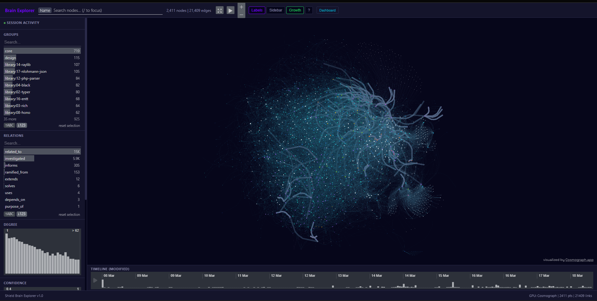

---

## Knowledge Distribution (Day 13)

| Category | Nodes | % | What it contains |
|----------|-------|---|------------------|
| Library | 1,392 | 57% | 26 open-source libraries across C, C++, Go, Python, JS, PHP, Rust, Java |
| Errors | 402 | 17% | Error→Solution pairs from the system's own failures |
| Investigations | 311 | 13% | Worker-driven deep analysis with GUID-indexed traceability |
| Projects | 158 | 7% | Architecture maps, hotspots, conventions for 14 real projects |
| Design | 116 | 5% | Architectural decisions, hypotheses, experimental results |
| Other | 48 | 2% | Patterns, directives, identity, conventions |

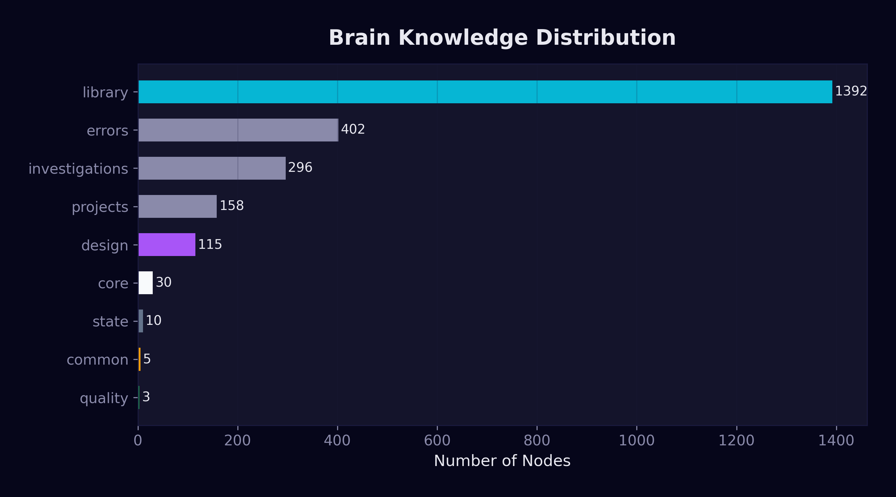

---

## Day 1 — March 8: Birth (0 → 102 nodes)

Shield starts with its own architecture. 32 nodes, 68 edges. Two visible clusters: design/philosophy and architecture documentation, connected but structurally distinct.

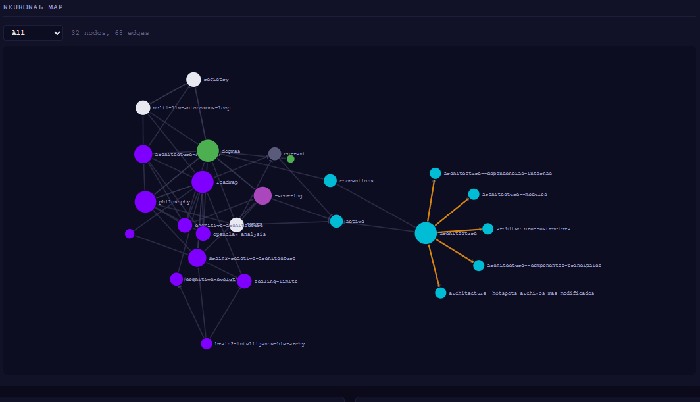

The first project onboarded is Shield itself. Within hours, three more projects enter: DocsConverter (Python), PGX Docs Studio (FastAPI), and PlatanoGamesAcademy (WordPress/PHP). Each addition visibly changes the graph's shape.

The most striking event of Day 1: between 9:28 PM and 9:48 PM, the brain jumps from 73 to 95 nodes as the keeper runs its first autonomous scan of PlatanoGamesAcademy. 22 nodes in 20 minutes, zero human input. This is the first sign that autonomous scanning generates knowledge faster than manual analysis.

Day 1 ends with BEI at 72. The Brain Efficiency Index is Shield's first composite health metric — four dimensions combined into a 0-100 score. It will not survive Day 10.

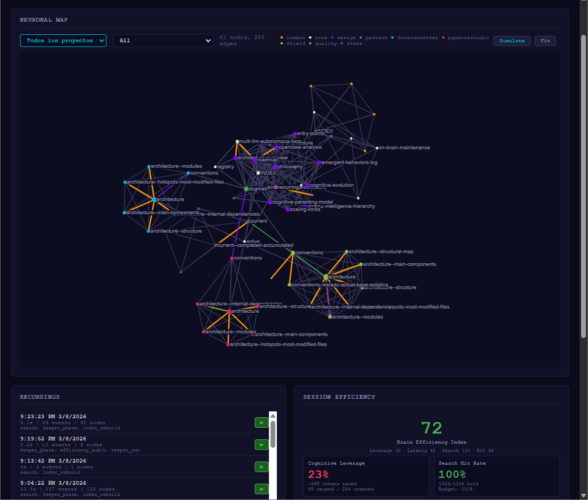

**Day 1 numbers:**

| Metric | Value |
|--------|-------|
| Start nodes | 32 |
| End nodes | 102 |
| Edges | 478 |
| Projects added | 5 |
| BEI | 72 |
| Human node creation | 0 |

---

## Days 2–3 — March 9–10: First C++ Projects (102 → 396 nodes)

PluginPGX enters — the first Unreal Engine C++ plugin. Then FrameworksPGX: 28 C++ plugins, 991 files, 8 years of accumulated code. The brain now spans Python, PHP, JavaScript, and C++ simultaneously.

The Library Learner pipeline activates for the first time. Abstract concepts begin appearing as nodes: `spatial-partitioning`, `command-pattern`, `finite-state-machine`. The brain is no longer just recording project architectures — it is learning transferable patterns.

The worker count grows to 30+ orchestrated in parallel. Cloud workers handle audit and code analysis. Each worker card shows role, provider, duration, and output lines.

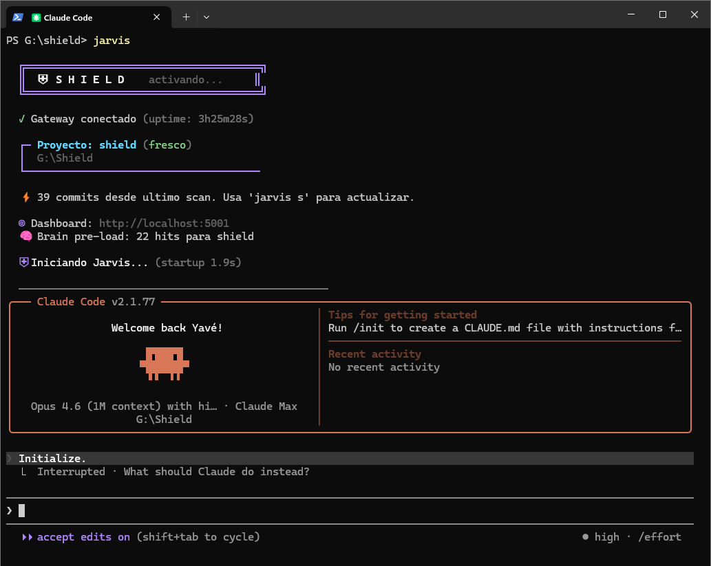

**Days 2–3 numbers:**

| Metric | Value |
|--------|-------|
| New nodes | ~294 |
| New projects | 2 (PluginPGX + FrameworksPGX) |
| Worker peak | 30+ concurrent |
| First library nodes | ~40 |
| Languages covered | 4 (Python, PHP, JS, C++) |

---

## Days 4–5 — March 11–12: Epistemic Immune System

The system's first self-diagnostic crisis. Workers were producing findings, but how do you know a finding is real and not a hallucination? The forensic investigation architecture is designed: every bug fixed by a worker becomes a brain node with problem, solution, file path, and severity. Error-driven learning becomes a first-class pipeline.

Local models are tested for audit quality. Results: high false positive rate. Local models are reclassified to translation and batch classification only. Cloud workers handle all audits from this point forward.

The Investigation Cluster is designed: a dedicated brain region for worker-driven deep analysis results, cross-indexed by GUID, separate from project and library knowledge.

**63 workers launched in a single session. 44 bugs fixed.**

---

## Day 6 — March 13: The Force-Graph Wall (~700 nodes)

At approximately 700 nodes, the CPU-based visualization hits its practical limit. The graph renders, but interaction is sluggish. Labels are unreadable. Hover tooltips lag by seconds.

This is not a failure — it is a measurement. The force-graph served well from Day 1. The transition to GPU-accelerated rendering (Cosmograph) is scheduled.

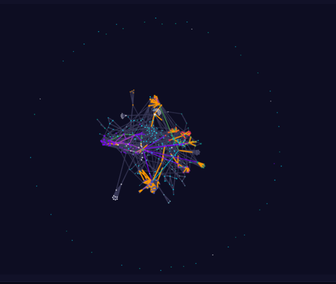

Library cluster filtering becomes the main navigation tool. Each of the 26 library clusters can be isolated. The learner pipeline has produced enough nodes that library knowledge now dominates the graph.

The Library Learner reaches v0.4: A new cloud backend integrated. Multiple models now vote on every concept. Only consensus-validated knowledge enters the brain.

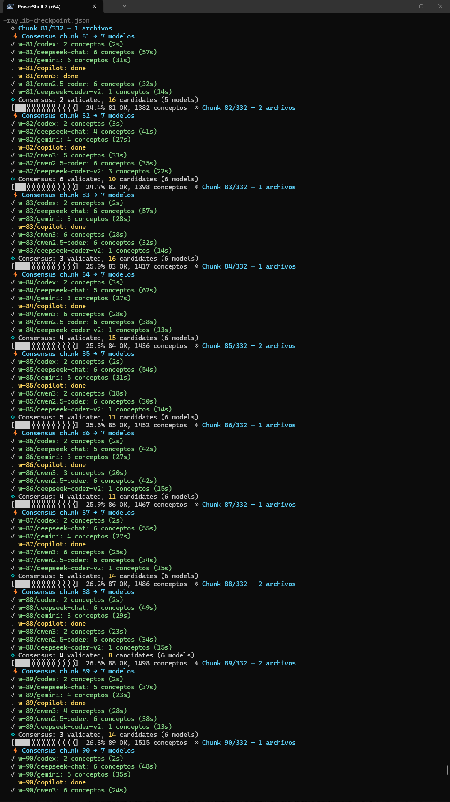

**Day 6 numbers:**

| Metric | Value |
|--------|-------|
| Brain nodes | ~700 |
| Library clusters running | 18 |
| Models in consensus | 7 |
| Visualization: force-graph | At limit |

---

## Day 7 — March 14: Investigation Cluster Born (+471 nodes in one day)

The largest single-day growth. Three things happen simultaneously:

1. Library Learner batch runs across multiple libraries — 7-model consensus at scale
2. The Investigation Cluster is built: 138 curated error→investigation nodes from worker output history
3. The Forensic daemon begins operating autonomously, extracting error-solution pairs from every worker completion

The result: **821 → ~1,026 nodes in one day**. The graph develops a new structural feature — a white/gray region on the right. This is the Investigation Cluster. Its nodes have no project color because they represent cross-cutting error patterns, not project-specific knowledge.

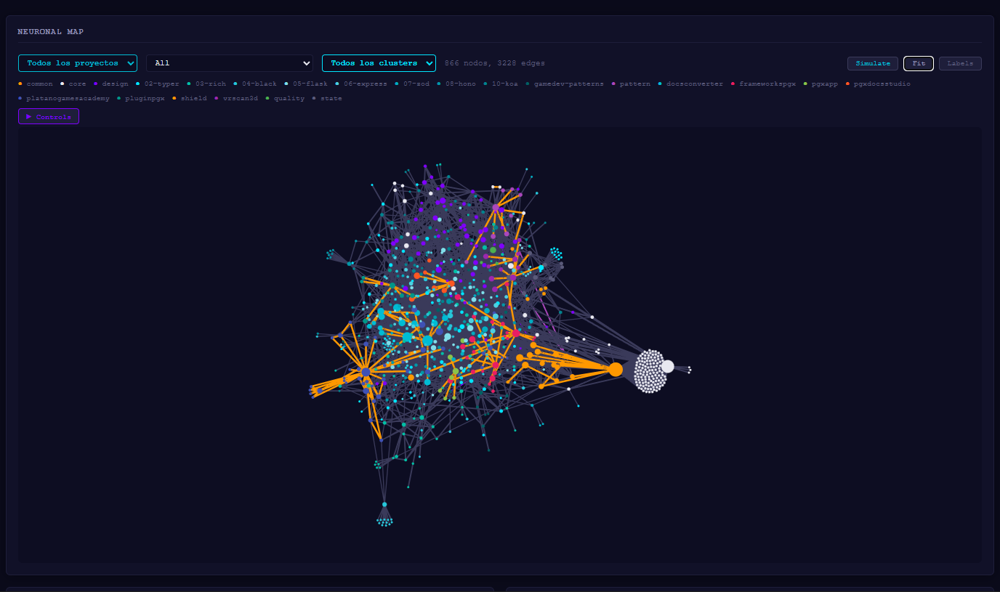

**The three-brain structure becomes visible for the first time:**
- Left mass: Project knowledge (colored by project)
- Center: Design and architecture (bridges between clusters)
- Right blob: Investigation cluster (error-driven, cross-cutting)

The `investigation_lookup.py` tool is built: TF-IDF semantic lookup over investigation nodes, zero tokens per query. Test result: "cooking recipes" → 0 hits. "session monitor shutdown race condition" → 5 exact hits with file:line. Knowledge is now addressable.

**Epistemic tests E-001 to E-004c run:** Testing whether the system admits "I don't know" when the brain has no evidence. Key finding: the same model passes the test in CLI (stops in 1-3 calls) and fails in raw API (loops 8-22+ calls). Epistemic honesty is a nurture property, not a model property. H-002 confirmed with code evidence.

**Day 7 numbers:**

| Metric | Value |
|--------|-------|
| Nodes added | +471 |
| Investigation nodes | 138 |
| Worker outputs processed | ~141K lines |
| Forensic markers extracted | 60 |
| Epistemic tests | 6 (E-001 to E-004c) |

---

## Days 8–9 — March 15–16: Autonomous Cure

Keeper runs its first fully autonomous quality cycle. The process:
1. Health scan: identify broken links, contradictions, orphaned nodes
2. Cluster bridging: connect disconnected subgraphs to the main connected component
3. Edge validation: remove spurious edges (Flask→C++ connection rejected)
4. Metrics refresh: recompute confidence scores

Result: **0 orphan nodes** (was 13). **0 dangling edges**. **0 contradictions unresolved.**

The orphan bridge rule is discovered empirically: connecting orphans to each other creates isolated mini-clusters. Each orphan must bridge to at least one node in the main connected component. The keeper now enforces this automatically.

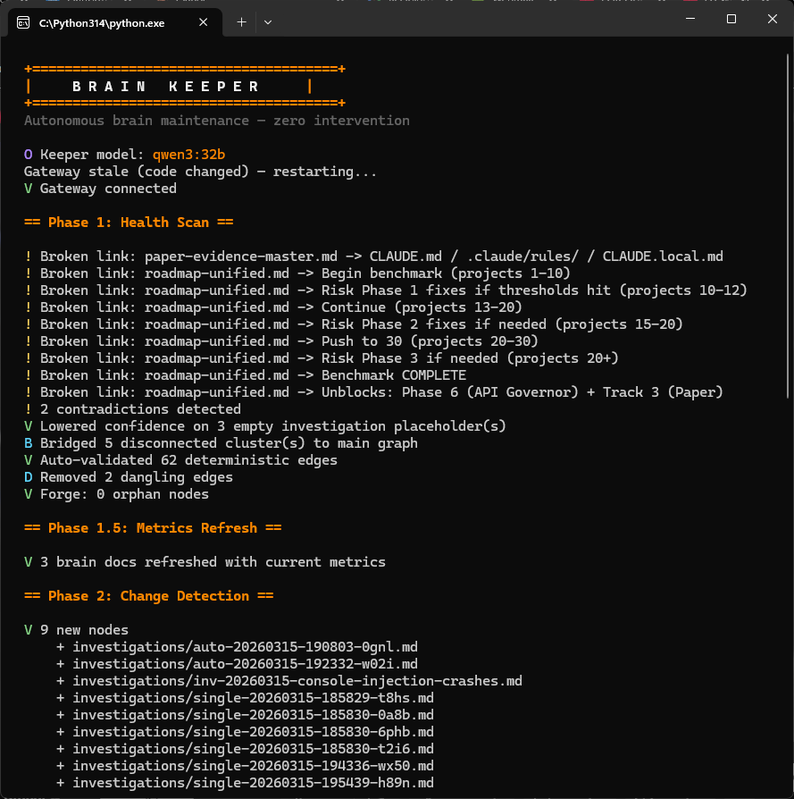

The Jarvis API REPL is built: streaming output, rich markdown rendering, multi-provider routing, toolbar with live status. The system can now operate through a terminal REPL as an alternative to Claude Code CLI.

**Commits per day at peak: ~45.**

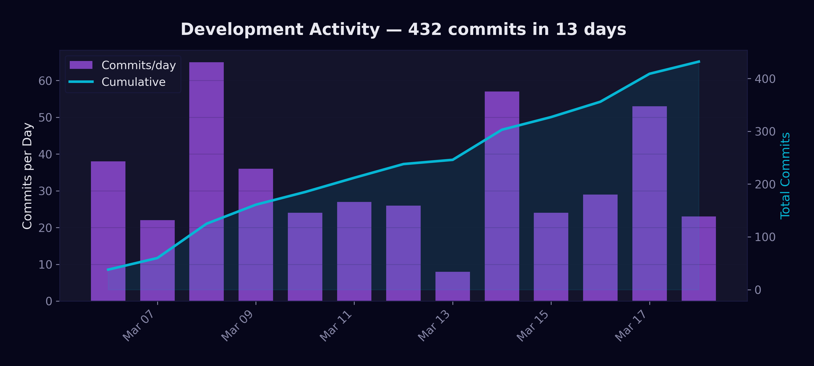

---

## Day 10 — March 17: BEI Dies, Real Metrics Live

After 8 calibration rounds over 10 days, BEI is deprecated.

**The three documented failures:**

1. **Self-contamination**: The dashboard displaying BEI generated 90% of the events used to compute BEI. The measurement instrument contaminated the measurement. 2,452 raw graph load events reduced to 139 clean samples after filtering dashboard polling.

2. **Saturation**: The "Passive" dimension always scored 100 because it measured node loading at startup — which always succeeded. A metric that never changes carries no information.

3. **Undiagnosable composite**: When BEI dropped from 72 to 57, the score couldn't tell you which dimension failed. You needed to decompose it anyway, making the composite redundant.

BEI is replaced by decomposed subsystem metrics:

| Subsystem | Metric | Example value |
|-----------|--------|---------------|
| Jarvis | Brain activations per session | 512 |
| Keeper | Maintenance runs | 67 |
| Learn | Library nodes produced | 913 |
| Forensic | Error markers curated | 60 |
| Search | Hit rate | 98% |
| Leverage | Token savings ratio | 96% |
| Library | Coverage across clusters | 50.1% |

Each metric is independently actionable. The full BEI calibration history (8 rounds, all documented with evidence) is preserved.

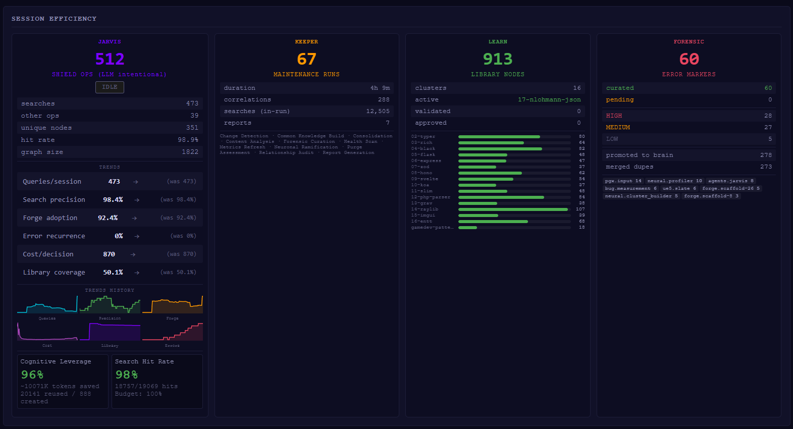

---

## Day 11 — March 18: GPU Visualization + Dashboard v2

### Brain Explorer

Cosmograph replaces the CPU force-graph. 2,411 nodes and 21,409 edges render as a real-time constellation at 60fps on GPU. The visualization that struggled at 700 nodes now handles 3x that without frame drops.

Features: interactive search with real-time highlight, crossfilter histograms (degree, confidence, date), timeline with growth animation playback, detail panels on selection, relation type filtering.

### Dashboard v2

Complete redesign: left sidebar navigation, card-based layout, real-time status feeds. The composite BEI widget is gone. Each subsystem has its own panel with independent metrics.

### Growth curve (11 days of brain data)

Three phases visible in the curve:
- **Bootstrap (Days 1–5)**: Project onboarding drives growth. ~50 nodes/day.
- **Acceleration (Days 6–7)**: Library Learner + Investigation Cluster activate. ~400 nodes/day peak.
- **Sustained (Days 8–11)**: All autonomous systems running. ~300 nodes/day average.

---

## Library Clusters (26 libraries, 1,392 nodes)

Each library was processed by the 7-model consensus pipeline. A concept requires agreement across models to become a brain node. A single model's hallucination cannot create a node.

| Cluster | Language | Nodes | Domain |
|---------|----------|-------|--------|
| 14-raylib | C | 107 | Game development, graphics |
| 17-nlohmann-json | C++ | 105 | JSON parsing |
| 12-php-parser | PHP | 84 | AST parsing |
| 04-black | Python | 82 | Code formatting |
| 02-typer | Python | 80 | CLI frameworks |
| 16-entt | C++ | 68 | Entity Component System |
| 03-rich | Python | 64 | Terminal rendering |
| 08-hono | TypeScript | 62 | Web framework |
| 25-gson | Java | 61 | JSON serialization |
| 09-svelte | JavaScript | 54 | UI framework |
| 20-bat | Rust | 51 | File viewer |
| 19-ripgrep | Rust | 50 | Search tool |
| 05-flask | Python | 48 | Web framework |
| 11-slim | PHP | 48 | Micro-framework |
| 06-express | JavaScript | 47 | Web framework |
| 22-cobra | Go | 43 | CLI framework |
| 24-fzf | Go | 40 | Fuzzy finder |
| 15-imgui | C++ | 39 | Immediate-mode GUI |
| 18-spdlog | C++ | 39 | Logging |
| 13-grav | PHP | 38 | CMS |
| 07-zod | TypeScript | 37 | Schema validation |
| 10-koa | JavaScript | 37 | Web framework |
| 21-fd | Rust | 31 | File finder |
| gamedev-patterns | Multi | 30 | Design patterns |
| 23-fiber | Go | 27 | Web framework |
| nurture | Multi | 20 | AI behavioral patterns |

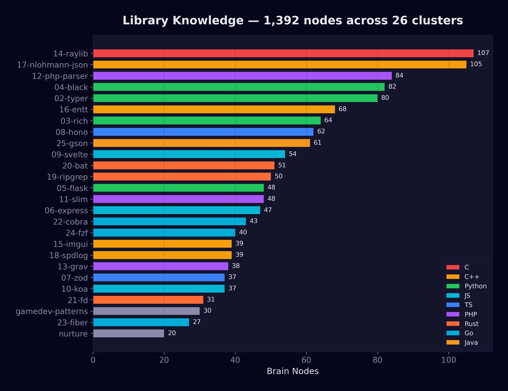

---

## Projects Validated (14 projects)

| Project | Stack | Workers | Quality |
|---------|-------|---------|---------|
| Shield | Python | 80+ | 9/10 |
| DocsConverter | Python | 12 | 8/10 |
| PGX Docs Studio | Python / FastAPI | 15 | 9/10 |
| PlatanoGamesAcademy | WordPress / PHP | 20 | 9/10 |
| PGX App | Python / Qt | 8 | pending |
| PluginPGX | C++ / UE5.4 | 11 | 9/10 |
| Frameworks PGX | C++ / UE5.4 (28 plugins) | 25 | 9/10 |
| Shield CLI v1 | Go / bubbletea | in progress | — |
| + 6 library analysis runs | Multi | 200+ | — |

---

## Worker Activity

500+ workers launched across 13 days. Three tiers: subscription CLIs (zero marginal cost), API-based (pay-per-use), and local (zero cost, classification only). The system auto-routes to the best available provider.

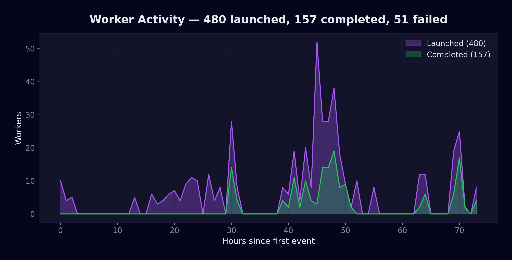

---

## Forensic Captures (171 total)

Every bug fixed during development was captured to the forensic index: problem, solution, file, line, severity, confidence, domain tags. The index is queryable at zero token cost — a lookup replaces a fresh investigation.

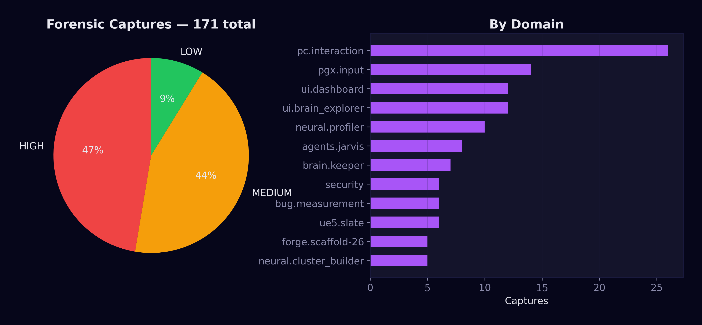

| Severity | Count | % |
|----------|-------|---|
| HIGH | 81 | 47% |
| MEDIUM | 75 | 44% |
| LOW | 15 | 9% |

Error-driven learning: the system's own failures become its training data. Each forensic capture feeds the brain. Recidivism — fixing the same bug twice — is detectable and measurable.

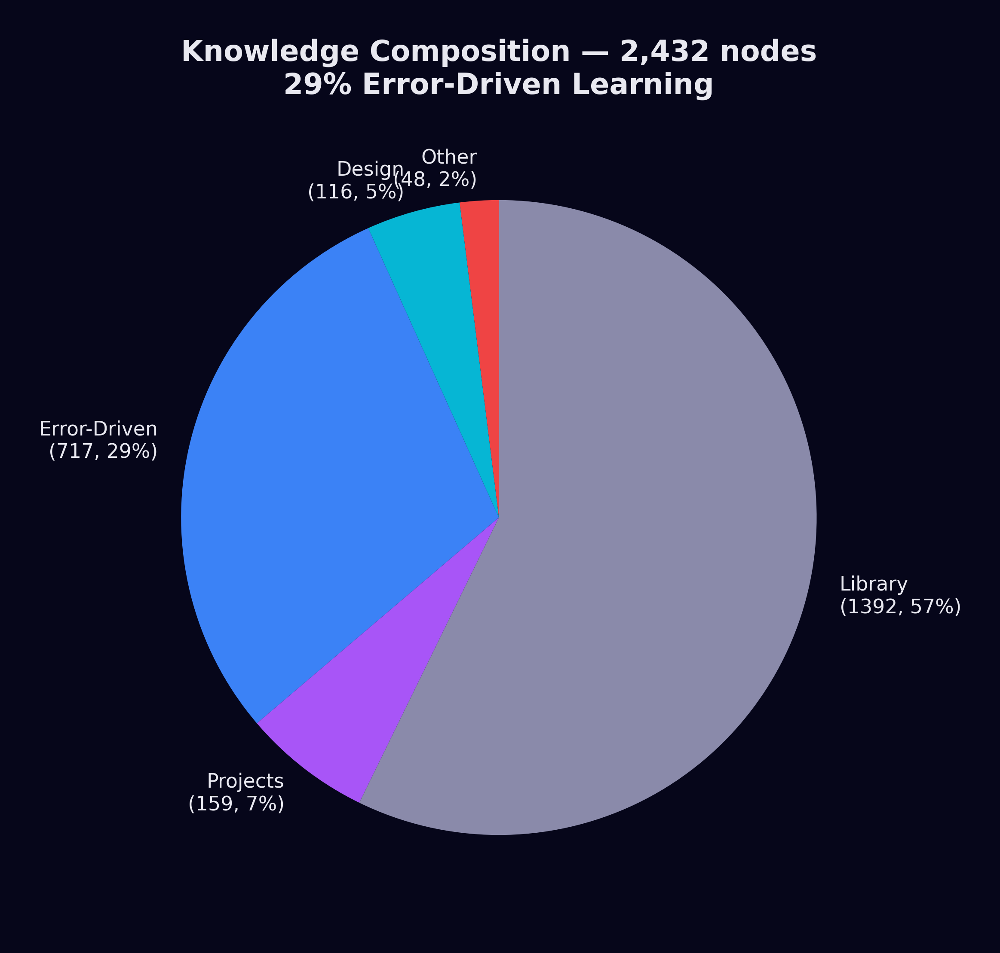

---

## Brain Events (42,746 total)

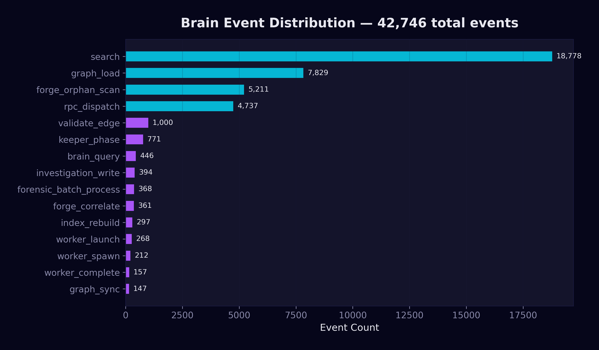

The single largest event type: **search (18,778 events)**. Every search executes against a local index — zero tokens consumed, sub-50ms latency. The brain acts as a query cache that grows more valuable as it grows larger.

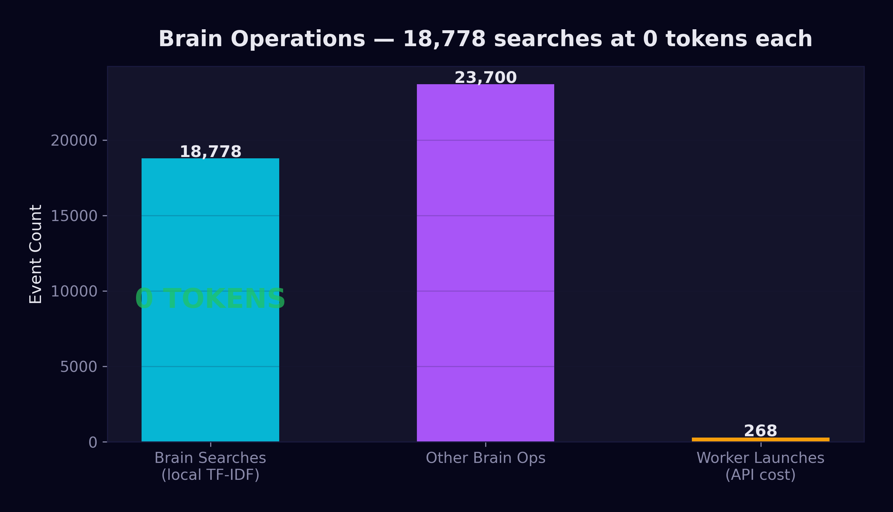

Across 13 days of active development, brain searches saved an estimated 2.2M tokens that would otherwise have required API calls. The index had 7,252 keywords at Day 13.

---

## Keeper Activity

The Keeper is an autonomous daemon that runs maintenance cycles without human intervention: health scans, orphan bridging, contradiction detection, edge validation, metrics refresh.

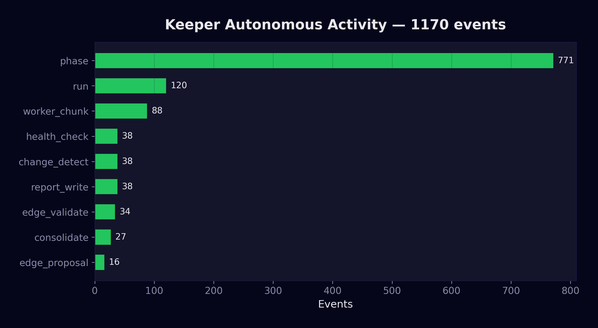

67 maintenance runs across the development period. The keeper reached its operational form on Day 8 when it ran a full cure cycle (13 orphans bridged, 0 contradictions unresolved) without any human direction.

---

## Cost Distribution

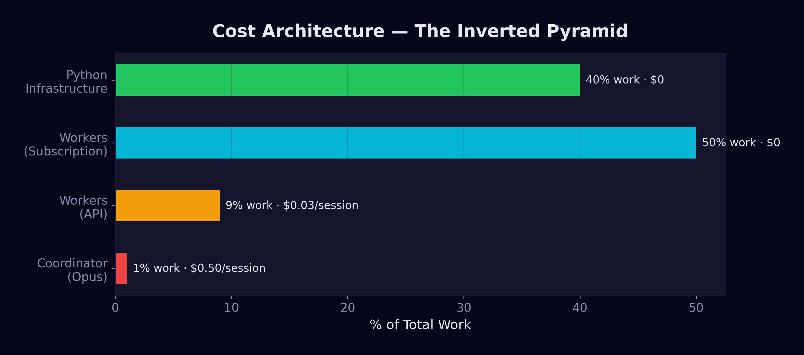

The cost structure inverted from what most AI systems produce:

| Tier | % of compute | Role |
|------|-------------|------|
| Python local tools | ~0% | Brain queries, index lookups, tool execution |
| Subscription CLIs | ~0% marginal | Audit, code review |
| Cache hits | ~90% savings | Repeated context |
| Expensive model (judgment) | 0.3% | Decision, consolidation |

The architecture is designed so that exploration — the expensive, parallelizable part — is handled by zero-marginal-cost tools. Judgment — the cheap, sequential part — is handled by the expensive model. Token costs scale with decisions made, not with data processed.

---

## Key Discoveries Across 13 Days

| Day | Discovery | Evidence |
|-----|-----------|----------|
| 1 | Autonomous scanning generates knowledge faster than manual analysis | 22 nodes in 20 minutes, zero human input |
| 2 | Local LLMs hallucinate at high rates for code audit | Majority of findings were false positives |
| 4 | BEI self-contamination: observer effect in metrics | Dashboard generated 90% of BEI events |
| 5 | Worker context starvation: 1.4% relevant context reaching workers | Brain sync raised to ~40% coverage |
| 6 | Force-graph visualization hard wall at ~700 nodes | Interaction latency >3s, labels unreadable |
| 7 | Epistemic honesty is nurture, not model property | Same model: CLI stops in 1-3 calls, API loops 22+ |
| 8 | Orphan bridging to other orphans creates isolated mini-clusters | Keeper auto-detects, enforces main component bridge |
| 9 | Composite metrics hide the signal they claim to expose | BEI deprecated, replaced by decomposed subsystem metrics |
| 10 | ExitPlanMode causes -93% brain usage dropout | Second dropout vector after context compaction |
| 11 | GPU-accelerated graph handles 3x the nodes that broke CPU rendering | Cosmograph: 2,411 nodes at 60fps |

---

## Relationship Types

| Relation | Count | Meaning |
|----------|-------|---------|
| related_to | 14,987 | Structural connectivity backbone |
| investigated | 5,989 | Worker investigation produced this connection |
| informs | 305 | Knowledge from A influences decisions about B |
| ramified_from | 153 | B was derived or branched from A |
| extends | 12 | B builds upon A |
| solves | 6 | A solves the problem described in B |
| uses | 4 | A uses B as a dependency |
| depends_on | 3 | A cannot function without B |
| purpose_of | 1 | A exists to serve B |

---

*All screenshots were taken during active development sessions. Metrics visible in images match the system's recorded state at those timestamps. No data was staged or modified for documentation.*
